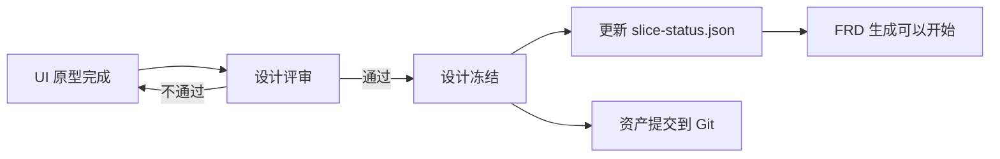

# AgentifUI 设计工作流程

> **版本**：v1.0  
> **最后更新**：2026-01-27  
> **适用范围**：Phase 1 所有切片

---

## 概述

本文档描述设计工作在 AgentifUI 项目开发中的完整流程。设计采用**设计先行、并行开发**的模式，设计师提前一个切片进行 UI 原型设计，确保设计与开发可以并行推进，避免相互阻塞。

---

## 一、整体时间线

```
Phase 1-A        Phase 1-D        Phase 1-E
    │               │               │
    ▼               ▼               ▼
┌─────────┐    ┌─────────┐    ┌─────────────────────────────────────┐
│ 设计系统 │    │ 骨架代码 │    │ S1 FRD → S1 开发 → S2 FRD → S2 开发 │
│   v0    │ ─→ │ (含Token)│ ─→ │                                     │
└─────────┘    └─────────┘    └─────────────────────────────────────┘
                                  ↑           ↑           ↑
                              S1 设计冻结  S2 设计冻结  S3 设计冻结
```

---

## 二、分阶段详解

### Phase 1-A：建立设计基线

| 属性 | 说明 |
|------|------|
| **时机** | 与技术基线规范同步进行 |
| **产出物** | `design/DESIGN_SYSTEM_P1.md` |
| **负责人** | Tech Lead + 设计师（如有） |

**内容范围**：

- **设计令牌**：颜色、字体、间距、圆角、阴影、动画
- **核心组件规范**：Button、Input、Card、Modal
- **通用状态规范**：Loading / Empty / Error / Success
- **响应式断点**：Desktop / Tablet / Mobile
- **AI 对话场景专用规范**：消息气泡、流式输出、Trace 信息

**配套文件**：

| 文件 | 路径 | 用途 |
|------|------|------|
| 表单交互规范 | `design/patterns/FORM_PATTERNS.md` | 表单校验、提交行为 |
| 模态框交互规范 | `design/patterns/MODAL_PATTERNS.md` | 弹窗结构、焦点管理 |
| 列表交互规范 | `design/patterns/LIST_PATTERNS.md` | 列表加载、分页、筛选 |

---

### Phase 1-D：设计系统落地到代码

| 属性 | 说明 |
|------|------|
| **时机** | 项目骨架生成时 |
| **产出物** | CSS Token 文件、基础 UI 组件 |

**设计师任务**：

1. 确认设计系统已完备
2. **开始 S1 切片的 UI 原型设计**（提前一个切片）

---

### Phase 1-E：切片级设计循环

每个切片遵循以下设计工作流：

```
┌──────────────────────────────────────────────────────────────────────┐
│                        切片设计工作流                                │
├──────────────────────────────────────────────────────────────────────┤
│                                                                      │
│    Week N-1                    Week N                     Week N+1   │
│    ┌─────────────┐        ┌─────────────┐            ┌─────────────┐ │
│    │ S2 UI 原型  │        │ S2 设计评审 │            │ S3 UI 原型  │ │
│    │   设计中    │───────→│  & 冻结     │───────────→│   设计中    │ │
│    └─────────────┘        └──────┬──────┘            └─────────────┘ │
│                                  │                                   │
│                                  ▼                                   │
│                          ┌─────────────┐                             │
│                          │ S2 FRD 生成 │                             │
│                          │(引用冻结设计)│                             │
│                          └──────┬──────┘                             │
│                                 │                                    │
│                                 ▼                                    │
│                          ┌─────────────┐                             │
│                          │  S2 开发    │                             │
│                          └─────────────┘                             │
│                                                                      │
└──────────────────────────────────────────────────────────────────────┘
```

---

## 三、设计先行并行工作流

> 设计提前一个切片，与开发并行进行，避免阻塞。

```
┌─────────────────────────────────────────────────────────────────┐
│                 设计先行并行工作流                           │
├─────────────────────────────────────────────────────────────────┤
│                                                                 │
│  设计师线程:   S2 UI原型 ──→ 设计评审 ──→ 冻结 ─────────────────│
│                    │                    │                       │
│                    │        ┌───────────┘                       │
│                    ▼        ▼                                   │
│  FRD线程:      ─────────→ S2 FRD生成（引用已冻结的设计）           │
│                              │                                  │
│                              ▼                                  │
│  开发线程:     S1 实现 ───────────────→ S2 实现                  │
│                                                                 │
└─────────────────────────────────────────────────────────────────┘
```

---

## 四、设计师周任务分配

| 周次 | 当前切片开发 | 设计师任务 |
|------|-------------|-----------|
| Week 1 | S1 开发 | 🎨 **S2 UI 原型设计** |
| Week 2 | S2 开发 | 🎨 **S3 UI 原型设计** |
| Week 3 | S2 开发续 | 🎨 S3 UI 评审 & 冻结 |
| Week 4 | S3 开发 | 🎨 **Phase 2 设计系统迭代** |

---

## 五、设计资产产出物

### 目录结构

每个切片的设计资产存放在 `design/slices/S{X}/`：

```
design/slices/S1/
├── login-page.png              # 登录页默认状态
├── login-page-loading.png      # 登录页加载状态
├── login-page-error.png        # 登录页错误状态
├── app-list.png                # 应用列表默认状态
├── app-list-empty.png          # 应用列表空状态
└── S1_UI_SPEC.md               # S1 设计说明文档
```

### 命名规范

| 类型 | 命名格式 | 示例 |
|------|----------|------|
| 默认状态 | `{page-name}.png` | `login-page.png` |
| 状态变体 | `{page-name}-{state}.png` | `login-page-error.png` |
| 响应式变体 | `{page-name}-{breakpoint}.png` | `app-list-mobile.png` |
| 设计说明 | `S{X}_UI_SPEC.md` | `S1_UI_SPEC.md` |

### 必须覆盖的状态

每个页面必须提供以下状态的设计：

- **Loading**：加载中状态
- **Success**：成功/正常状态
- **Error**：错误状态
- **Empty**：空数据状态（列表类页面）

---

## 六、设计冻结流程

### 流程图



### 设计评审清单

- [ ] 遵循 `DESIGN_SYSTEM_P1.md` 设计令牌（颜色/字体/间距）
- [ ] 遵循 `design/patterns/*.md` 交互模式
- [ ] 覆盖所有必要状态（Loading / Empty / Error / Success）
- [ ] 覆盖所有用户角色的视图差异（如有）
- [ ] 响应式断点处理合理
- [ ] 与已完成切片的 UI 风格一致
- [ ] 无未定义的新组件（如需新组件，走设计系统变更流程）

### 冻结操作

1. 将设计资产提交到 Git 仓库 `design/slices/S{X}/`
2. 更新 `.agent/context/slice-status.json`：
   ```json
   {
     "S1": {
       "design": {
         "designFrozen": true,
         "designFrozenAt": "2026-01-27",
         "designAssets": [
           "design/slices/S1/login-page.png",
           "design/slices/S1/S1_UI_SPEC.md"
         ]
       }
     }
   }
   ```
3. 通知相关人员设计已冻结

### 冻结后规则

| 允许 | 禁止 |
|------|------|
| ✅ 修复明显的视觉 Bug | ❌ 修改布局 |
| ✅ 调整文案措辞 | ❌ 修改交互流程 |
| | ❌ 修改组件结构 |

> ⚠️ 如需做禁止的修改，必须走「规范变更协议」

---

## 七、设计与 FRD 的关系

FRD 中的 UI/UX 章节**只引用不定义**：

### 可以做

- ✅ 引用 DESIGN_SYSTEM 版本号
- ✅ 描述页面结构和路由
- ✅ 描述交互流程（Mermaid 图）
- ✅ 引用冻结的原型图路径
- ✅ 描述状态触发条件

### 不可以做

- ❌ 定义新颜色值（必须使用设计令牌）
- ❌ 定义新字号/间距（必须使用设计令牌）
- ❌ 创建新组件样式（需先更新设计系统）
- ❌ 内联样式描述
- ❌ 重复定义状态样式

---

## 八、关键检查点

| 检查点 | 时机 | 校验内容 | 负责人 |
|--------|------|----------|--------|
| 设计评审 | 原型完成后 | 遵循设计系统、覆盖所有状态 | 设计师 + Tech Lead |
| 设计冻结 | FRD 生成前 | 评审通过、资产提交 | Tech Lead |
| FRD 校验 | FRD 完成后 | 设计一致性校验清单 | AI Agent + 人工 Review |
| 代码 Review | PR 提交后 | 样式是否使用设计令牌 | 前端工程师 |

---

## 九、相关文档索引

| 文档 | 路径 | 用途 |
|------|------|------|
| 设计系统基线 | `design/DESIGN_SYSTEM_P1.md` | 设计约束 SSOT |
| 表单交互规范 | `design/patterns/FORM_PATTERNS.md` | 表单最佳实践 |
| 模态框交互规范 | `design/patterns/MODAL_PATTERNS.md` | 弹窗最佳实践 |
| 列表交互规范 | `design/patterns/LIST_PATTERNS.md` | 列表最佳实践 |
| 设计评审工作流 | `.agent/workflows/design_review.md` | 评审 SOP |
| 切片设计资产 | `design/slices/S{X}/` | 原型图存放 |
| 切片状态追踪 | `.agent/context/slice-status.json` | 冻结状态记录 |
| 规范版本追踪 | `.agent/context/spec_versions.json` | 设计规范版本 |

---

## 十、常见问题

### Q1：如果设计资产来不及冻结怎么办？

A：可以使用「线框图 + 文字描述」先生成 FRD 草稿，待设计冻结后再补充完整原型图引用。但 FRD 正式评审前必须完成设计冻结。

### Q2：设计系统需要新增组件怎么办？

A：走规范变更协议：
1. 提出新组件需求
2. 在 `DESIGN_SYSTEM_P1.md` 中添加组件规范
3. 更新版本号（v0.1 → v0.2）
4. 更新 `spec_versions.json`

### Q3：发现设计稿与设计系统不一致怎么办？

A：分两种情况：
- **设计稿错误**：修改设计稿，重新评审
- **设计系统需要更新**：走规范变更协议，先更新设计系统再更新设计稿

---

## 变更记录

| 版本 | 日期 | 变更内容 | 作者 |
|------|------|----------|------|
| v1.0 | 2026-01-27 | 初稿，定义完整设计工作流程 | AI Agent |

---

*文档结束*
