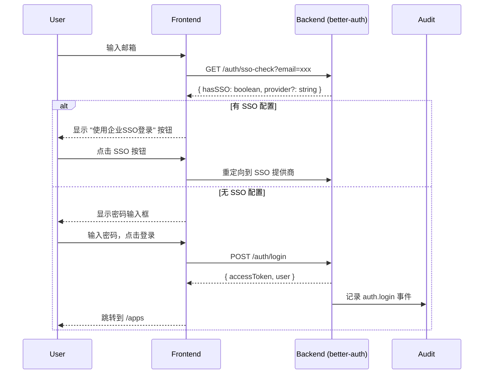
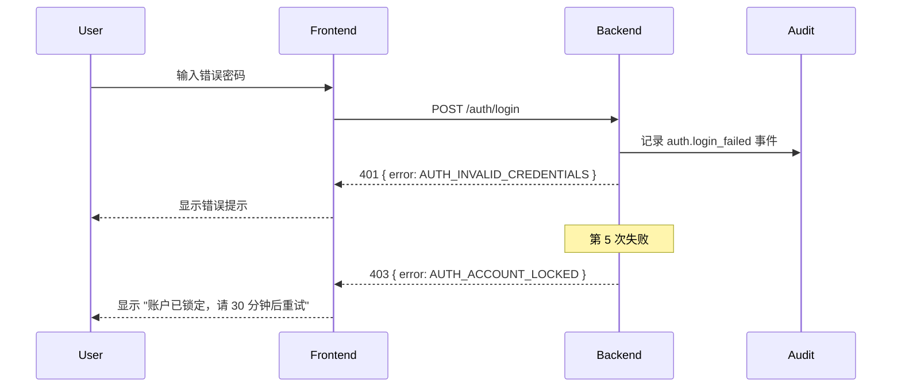

# FRD: 多租户身份认证基座

---

## 元信息

| 属性 | 值 |
|------|-----|
| **FRD ID** | AFUI-FRD-S1-1 |
| **来源切片** | S1-1 |
| **覆盖 Feature ID** | F-ORG-001, F-ORG-002, F-AUTH-001, F-AUTH-002, F-AUTH-005, F-AUTH-007 |
| **FRD 版本** | v0.1 |
| **最后更新** | 2026-01-27 |
| **状态** | 草稿 |
| **作者** | AI Agent |

### 引用基线规范版本

| 规范 | 版本 | 说明 |
|------|------|------|
| DOMAIN_MODEL | v0.2 | 涉及实体：Tenant, Group, User, GroupMember |
| GATEWAY_CONTRACT | v0.1 | 涉及接口：无（本切片为认证接口，不经过网关） |
| AUDIT_EVENTS | v0.1 | 涉及事件：auth.login, auth.logout, auth.login_failed |
| NFR_BASELINE | v0.2 | 性能指标：SSO 匹配 P95 ≤ 500ms |
| DESIGN_SYSTEM | v0.1 | 设计令牌、组件规范、状态规范 |

---

## Scope / Out of Scope

### In Scope（本 FRD 覆盖）

- [x] **邮箱密码登录**：用户通过邮箱 + 密码完成登录
- [x] **SSO 域名自动识别**：根据邮箱后缀自动识别 SSO 配置
- [x] **密码策略检查**：注册/修改密码时检查强度
- [x] **用户资料页**：查看和编辑个人资料
- [x] **登出功能**：安全登出并清理会话
- [x] **多租户数据隔离**：用户只能访问自己租户的数据

### Out of Scope（本 FRD 不覆盖）

- ❌ MFA/TOTP 配置（属于 S1-1 扩展，优先级 P1）
- ❌ OAuth/SAML SSO 实际对接（仅实现域名识别，实际登录流程待后续）
- ❌ JIT 用户创建（属于 F-AUTH-003，优先级 P1）
- ❌ 用户邀请功能（属于 F-AUTH-008，优先级 P1）
- ❌ 群组管理 CRUD（属于 S3-1 管理后台切片）

---

## User Story

### US-1：邮箱密码登录

**As a** 已注册用户  
**I want to** 使用邮箱和密码登录系统  
**So that** 我可以访问我被授权的 AI 应用

**补充说明**：
- 支持"记住我"延长会话有效期
- 连续 5 次失败锁定账户 30 分钟
- 登录成功后跳转到应用工作台

### US-2：SSO 域名识别

**As a** 企业用户  
**I want to** 系统自动识别我的企业邮箱对应的 SSO 配置  
**So that** 我可以直接跳转到企业 SSO 登录，无需记住多个密码

**补充说明**：
- 输入邮箱后自动检测
- 识别时间 ≤ 500ms
- 如无匹配，继续显示密码输入

### US-3：密码策略

**As a** 新用户/修改密码的用户  
**I want to** 设置符合安全要求的密码  
**So that** 我的账户安全得到保障

**补充说明**：
- 最少 8 位
- 必须包含大小写字母和数字
- 实时显示密码强度

### US-4：个人资料

**As a** 登录用户  
**I want to** 查看和编辑我的个人资料  
**So that** 其他用户可以正确识别我

**补充说明**：
- 支持修改：名称、头像、手机号
- 邮箱不可修改（作为唯一标识）

---

## UI/UX 描述

### 引用的设计规范

| 规范文件 | 引用内容 |
|----------|----------|
| DESIGN_SYSTEM_P1.md | Button(primary/outline), Input, Card, 语义色 |
| FORM_PATTERNS.md | 表单校验时机（blur + submit）、提交行为 |

### 页面结构

| 页面 | 路由 | 主要组件 | 设计稿链接 |
|------|------|----------|------------|
| 登录页 | `/login` | LoginForm, SSODetector | design/slices/S1/login.png |
| 用户资料页 | `/settings/profile` | ProfileForm, AvatarUpload | design/slices/S1/profile.png |

### 交互流程

#### 登录流程



#### 登录失败流程



### 状态说明

| 状态 | 触发条件 | UI 表现 | 引用规范 |
|------|----------|---------|----------|
| Loading | 登录请求发送中 | 按钮 disabled + Spinner，表单不可编辑 | DESIGN_SYSTEM_P1 `Loading` |
| Success | 登录成功 | Toast "登录成功" + 跳转 | DESIGN_SYSTEM_P1 `Success` |
| Error | 登录失败 | Input 边框变红 + 错误文案 | DESIGN_SYSTEM_P1 `Error` |
| SSO Detected | 检测到 SSO 配置 | 隐藏密码框，显示 SSO 按钮 | 自定义 |

### 响应式设计

| 断点 | 布局调整 |
|------|----------|
| ≥ 1024px (桌面) | 居中卡片，宽度 400px |
| 768px ~ 1023px (平板) | 居中卡片，宽度 90% |
| < 768px (移动端) | 全宽卡片，边距 16px |

### 页面原型

#### 登录页

```
┌─────────────────────────────────────┐
│            AgentifUI Logo            │
├─────────────────────────────────────┤
│                                     │
│         欢迎回来                     │
│         登录您的账户                 │
│                                     │
│  ┌───────────────────────────────┐  │
│  │ 邮箱                          │  │
│  └───────────────────────────────┘  │
│                                     │
│  ┌───────────────────────────────┐  │
│  │ 密码                    👁    │  │
│  └───────────────────────────────┘  │
│                                     │
│  ☐ 记住我          忘记密码？       │
│                                     │
│  ┌───────────────────────────────┐  │
│  │           登  录              │  │
│  └───────────────────────────────┘  │
│                                     │
│  ────────── 或 ──────────           │
│                                     │
│  ┌─────────┐  ┌─────────┐          │
│  │  Google │  │  飞书   │          │
│  └─────────┘  └─────────┘          │
│                                     │
│         还没有账户？ 联系管理员      │
│                                     │
└─────────────────────────────────────┘
```

---

## 数据契约

### API 接口

#### POST /api/auth/login

邮箱密码登录。

**Request**

```json
{
  "email": "user@example.com",
  "password": "SecurePass123",
  "rememberMe": true
}
```

| 字段 | 类型 | 必填 | 说明 |
|------|------|------|------|
| email | string | ✅ | 邮箱地址 |
| password | string | ✅ | 密码，≥ 8 位 |
| rememberMe | boolean | ❌ | 记住我，默认 false |

**Response (200 OK)**

```json
{
  "accessToken": "eyJhbGciOiJIUzI1NiIs...",
  "refreshToken": "eyJhbGciOiJIUzI1NiIs...",
  "expiresIn": 900,
  "user": {
    "id": "usr_abc123",
    "email": "user@example.com",
    "name": "张三",
    "avatar": "https://...",
    "tenantId": "ten_xyz789"
  }
}
```

**Error Response (401 Unauthorized)**

```json
{
  "error": {
    "code": "AUTH_INVALID_CREDENTIALS",
    "message": "邮箱或密码不正确"
  }
}
```

**Error Response (403 Forbidden)**

```json
{
  "error": {
    "code": "AUTH_ACCOUNT_LOCKED",
    "message": "账户已锁定，请 30 分钟后重试",
    "retryAfter": 1800
  }
}
```

---

#### GET /api/auth/sso-check

检查邮箱是否有对应的 SSO 配置。

**Query Parameters**

| 参数 | 类型 | 必填 | 说明 |
|------|------|------|------|
| email | string | ✅ | 邮箱地址 |

**Response (200 OK)**

```json
{
  "hasSSO": true,
  "provider": "google",
  "providerName": "Google Workspace",
  "loginUrl": "/api/auth/sso/google?email=xxx"
}
```

```json
{
  "hasSSO": false
}
```

---

#### POST /api/auth/logout

登出当前会话。

**Request**

无请求体。需携带 `Authorization: Bearer {token}` 请求头。

**Response (200 OK)**

```json
{
  "success": true
}
```

---

#### GET /api/users/me

获取当前登录用户信息。

**Response (200 OK)**

```json
{
  "id": "usr_abc123",
  "email": "user@example.com",
  "name": "张三",
  "avatar": "https://...",
  "phone": "+86 138****1234",
  "status": "active",
  "emailVerified": true,
  "mfaEnabled": false,
  "preference": {
    "theme": "system",
    "locale": "zh-CN"
  },
  "tenantId": "ten_xyz789",
  "groups": [
    {
      "id": "grp_001",
      "name": "产品团队",
      "role": "member"
    }
  ],
  "createdAt": "2026-01-01T00:00:00Z",
  "lastActiveAt": "2026-01-27T00:00:00Z"
}
```

---

#### PATCH /api/users/me

更新当前用户资料。

**Request**

```json
{
  "name": "张三丰",
  "avatar": "https://...",
  "phone": "+86 139****5678",
  "preference": {
    "theme": "dark"
  }
}
```

**Response (200 OK)**

返回更新后的完整用户对象（同 `GET /api/users/me`）。

---

### 错误码

| 错误码 | HTTP Status | 说明 | 用户可见消息 |
|--------|-------------|------|--------------| 
| AUTH_INVALID_CREDENTIALS | 401 | 邮箱或密码错误 | 邮箱或密码不正确 |
| AUTH_ACCOUNT_LOCKED | 403 | 账户已锁定 | 账户已锁定，请 {N} 分钟后重试 |
| AUTH_EMAIL_NOT_VERIFIED | 403 | 邮箱未验证 | 请先验证邮箱 |
| AUTH_ACCOUNT_DISABLED | 403 | 账户已禁用 | 您的账户已被禁用，请联系管理员 |
| AUTH_WEAK_PASSWORD | 400 | 密码强度不足 | 密码至少 8 位，需包含大小写字母和数字 |

---

## Trace / 审计 / 降级要求

### Trace 要求

- [x] 需要 Trace
- Trace 覆盖范围：登录/登出请求全链路
- Trace ID 传递：Response Header `X-Trace-ID`

### 审计要求

- [x] 需要审计

| 事件类型 | 触发时机 | 级别 | 关键字段 |
|----------|----------|------|----------|
| `auth.login` | 登录成功 | INFO | userId, tenantId, ip, userAgent |
| `auth.login_failed` | 登录失败 | WARNING | email, ip, reason, attemptCount |
| `auth.logout` | 登出 | INFO | userId, ip |
| `auth.account_locked` | 账户锁定 | WARNING | email, ip, lockDuration |
| `user.profile_updated` | 资料更新 | INFO | userId, changedFields |

### 降级要求

- [ ] 需要降级
- 降级场景：无（认证为核心链路，无法降级）

---

## 验收标准（AC）

### 功能验收

- [ ] **AC-1**：用户输入正确邮箱密码后，成功登录并跳转到 `/apps`
- [ ] **AC-2**：用户输入错误密码后，显示错误提示 "邮箱或密码不正确"
- [ ] **AC-3**：连续 5 次登录失败后，账户锁定 30 分钟，显示锁定提示
- [ ] **AC-4**：用户勾选"记住我"后，Session 有效期延长到 7 天
- [ ] **AC-5**：用户点击登出后，Session 失效，跳转到登录页
- [ ] **AC-6**：输入企业邮箱后，500ms 内显示 SSO 登录选项
- [ ] **AC-7**：密码强度不足时，显示实时校验提示

### 性能验收

- [ ] **AC-P1**：登录接口 P95 响应时间 ≤ 500ms
- [ ] **AC-P2**：SSO 域名识别 P95 ≤ 500ms

### 安全验收

- [ ] **AC-S1**：密码传输使用 HTTPS 加密
- [ ] **AC-S2**：密码存储使用 bcrypt/argon2 哈希
- [ ] **AC-S3**：登录失败日志记录 IP 和 UserAgent
- [ ] **AC-S4**：Session Token 使用 HttpOnly Cookie 存储

---

## E2E 测试用例

### Case 1：正常登录流程

| 步骤 | 操作 | 预期结果 |
|------|------|----------|
| 1 | 访问 /login | 显示登录表单 |
| 2 | 输入正确邮箱 test@example.com | 表单验证通过，显示密码输入框 |
| 3 | 输入正确密码 ValidPass123 | 表单验证通过 |
| 4 | 点击登录按钮 | 显示 Loading 状态 |
| 5 | 等待响应 | 跳转到 /apps，显示 Toast "登录成功" |

### Case 2：密码错误（失败场景）

| 步骤 | 操作 | 预期结果 |
|------|------|----------|
| 1 | 访问 /login | 显示登录表单 |
| 2 | 输入正确邮箱 + 错误密码 | 表单验证通过 |
| 3 | 点击登录按钮 | 显示 Loading 状态 |
| 4 | 等待响应 | 显示错误提示 "邮箱或密码不正确"，保持在登录页 |

### Case 3：账户锁定（边界场景）

| 步骤 | 操作 | 预期结果 |
|------|------|----------|
| 1 | 连续 4 次输入错误密码 | 每次显示错误提示 |
| 2 | 第 5 次输入错误密码 | 显示 "账户已锁定，请 30 分钟后重试" |
| 3 | 立即再次尝试登录 | 显示锁定提示，无法登录 |
| 4 | 30 分钟后重试 | 可正常登录 |

### Case 4：SSO 域名识别

| 步骤 | 操作 | 预期结果 |
|------|------|----------|
| 1 | 访问 /login | 显示登录表单 |
| 2 | 输入企业邮箱 user@acme.com | 500ms 内显示 "使用 Acme SSO 登录" 按钮 |
| 3 | 点击 SSO 按钮 | 跳转到 SSO 提供商登录页面 |

### Case 5：用户资料编辑

| 步骤 | 操作 | 预期结果 |
|------|------|----------|
| 1 | 登录后访问 /settings/profile | 显示当前用户资料 |
| 2 | 修改名称为 "新名称" | 输入框显示新值 |
| 3 | 点击保存 | 显示 Toast "保存成功"，名称更新 |

---

## 依赖与风险

### 依赖

| 依赖项 | 类型 | 状态 | 说明 |
|--------|------|------|------|
| better-auth 集成 | 技术 | 🔵 进行中 | 需完成 better-auth 配置 |
| Tenant/User/Group Schema | 数据模型 | ✅ 已冻结 | DOMAIN_MODEL_P1 v0.2 |
| 登录页 UI 设计 | 设计 | 🔲 待开始 | 需完成 Figma 设计稿 |

### 风险

| 风险 | 影响 | 概率 | 缓解措施 |
|------|------|------|----------|
| SSO 对接复杂度高 | 延期 | 中 | 本切片仅实现域名识别，实际 SSO 流程留待后续 |
| better-auth 定制难度 | 开发受阻 | 低 | 提前调研 better-auth 扩展点 |

---

## 变更记录

| 版本 | 日期 | 变更内容 | 作者 |
|------|------|----------|------|
| v0.1 | 2026-01-27 | 初稿 | AI Agent |

---

*文档结束*
