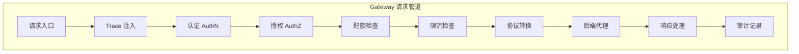
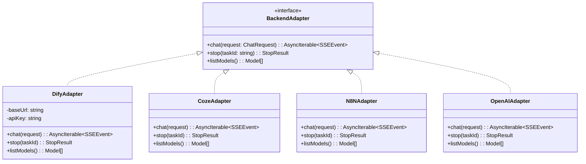
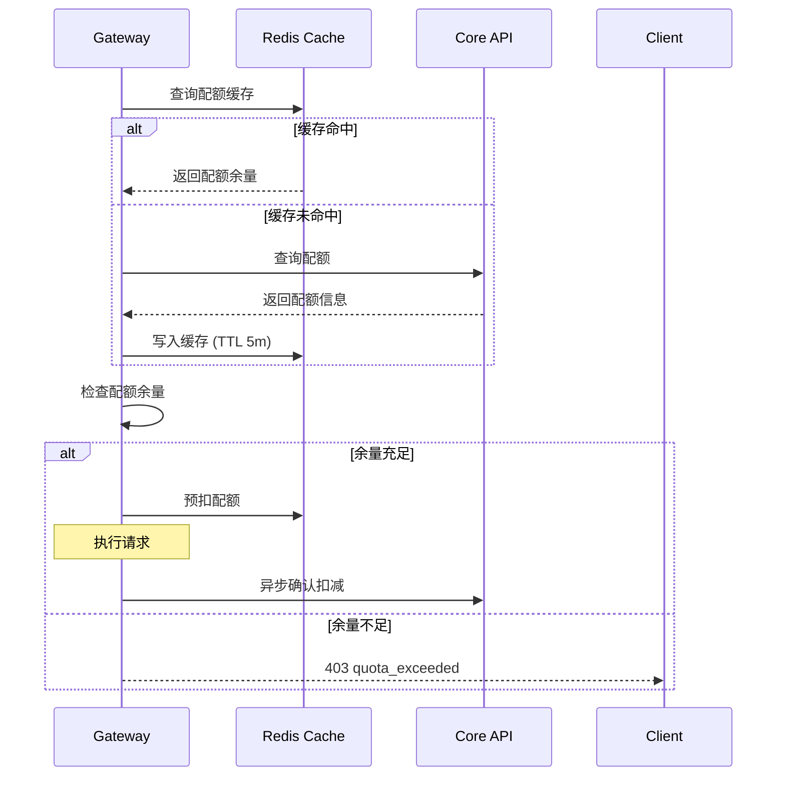

# AgentifUI Gateway 架构设计

* **规范版本**：v0.1
* **最后更新**：2026-01-27
* **状态**：草稿
* **依赖**：[GATEWAY_CONTRACT_P1.md](../tech/api-contracts/GATEWAY_CONTRACT_P1.md)

---

## 1. 项目概述

### 1.1 定位

AgentifUI Gateway 是一个**独立的 API 网关项目**，提供 OpenAI 兼容的统一接入层，支持对接多种后端 AI 编排平台。

```
┌──────────────────────────────────────────────────────────────┐
│                        Gateway 职责边界                       │
├──────────────────────────────────────────────────────────────┤
│  ✅ 协议适配（OpenAI Compatible → Backend Native）           │
│  ✅ 认证鉴权（JWT / API Key）                                 │
│  ✅ 权限检查（Resource-Based AuthZ）                          │
│  ✅ 配额管理（用户/群组/租户级别）                             │
│  ✅ 请求限流（多层级 Rate Limiting）                          │
│  ✅ 审计日志（操作留痕）                                      │
│  ✅ 全链路追踪（W3C Trace Context）                           │
│  ✅ 降级处理（后端不可用时的优雅降级）                         │
├──────────────────────────────────────────────────────────────┤
│  ❌ 业务逻辑（用户管理、对话持久化等）                         │
│  ❌ AI 编排（提示词、工具调用、模型选择）                      │
│  ❌ 数据存储（直接数据库操作）                                 │
└──────────────────────────────────────────────────────────────┘
```

### 1.2 设计目标

| 目标 | 描述 | 指标 |
|------|------|------|
| **轻量级** | 核心依赖 < 5MB，启动 < 500ms | Bundle 分析 |
| **高性能** | P99 延迟增量 < 10ms | 压测验证 |
| **可插拔** | 中间件即插即用，可按需启用 | 配置驱动 |
| **可观测** | 全链路追踪，结构化日志 | OpenTelemetry |
| **OpenAI 兼容** | 标准 API 契约 | 契约测试 |

### 1.3 技术栈

| 层级 | 技术选型 | 说明 |
|------|----------|------|
| **Runtime** | Node.js 22 LTS | 与主项目一致 |
| **Framework** | Fastify 5.x | 高性能、插件化 |
| **Auth** | @fastify/jwt | JWT 验证 |
| **Proxy** | @fastify/http-proxy | 后端转发 |
| **Rate Limit** | @fastify/rate-limit | 多层限流 |
| **Security** | @fastify/helmet, @fastify/cors | 安全头 |
| **Tracing** | OpenTelemetry SDK | 分布式追踪 |
| **Logging** | Pino | 结构化日志 |

---

## 2. 系统架构

### 2.1 请求处理管道



### 2.2 插件优先级

插件按优先级顺序注册，数字越小越先执行：

| 优先级 | 插件 | 职责 | 失败行为 |
|--------|------|------|----------|
| 0 | `tracing` | Trace ID 生成/注入 | 降级继续 |
| 5 | `healthCheck` | `/health` 健康检查 | 跳过其他插件 |
| 10 | `auth` | JWT/API Key 验证 | 401 终止 |
| 20 | `tenant` | 租户上下文注入 | 403 终止 |
| 30 | `authz` | 权限检查 | 403 终止 |
| 40 | `quota` | 配额检查与预扣 | 403 终止 |
| 50 | `rateLimit` | 请求限流 | 429 终止 |
| 60 | `compliance` | 合规检查（可选） | 可配置 |
| 100 | `audit` | 审计日志（后置） | 降级继续 |

### 2.3 后端适配器架构



---

## 3. 核心模块设计

### 3.1 认证模块 (AuthN)

**支持的认证方式**：

| 方式 | Header | 场景 | Phase 1 |
|------|--------|------|---------|
| JWT | `Authorization: Bearer {jwt}` | 用户登录态 | ✅ |
| API Key | `Authorization: Bearer {api_key}` | 系统集成 | ✅ |
| mTLS | 证书验证 | 服务间调用 | ❌ v2.0 |

**JWT 验证流程**：

```typescript
interface JWTPayload {
  sub: string;          // 用户 ID
  tenant_id: string;    // 租户 ID
  email?: string;
  roles: string[];      // 角色列表
  iat: number;
  exp: number;
}

// 验证步骤
// 1. 解析 JWT（不验证签名）
// 2. 调用 UserService 验证签名（JWKS 或共享密钥）
// 3. 验证 exp/iat
// 4. 注入 request.user
```

### 3.2 授权模块 (AuthZ)

**资源-操作模型**：

```typescript
interface AuthzRequest {
  subject: {
    userId: string;
    tenantId: string;
    groupIds: string[];
    roles: string[];
  };
  resource: {
    type: 'app' | 'conversation' | 'run';
    id: string;
  };
  action: 'read' | 'write' | 'execute' | 'admin';
}

interface AuthzResponse {
  allowed: boolean;
  reason?: string;
}
```

**Phase 1 简化实现**：

```typescript
// 调用主项目 API 检查权限
const checkPermission = async (req: AuthzRequest): Promise<AuthzResponse> => {
  const response = await fetch(`${CORE_API_URL}/internal/authz`, {
    method: 'POST',
    headers: { 'X-Internal-Token': INTERNAL_TOKEN },
    body: JSON.stringify(req)
  });
  return response.json();
};
```

### 3.3 配额模块 (Quota)

**配额检查流程**：



**Phase 1 简化**：调用 Core API 同步检查，不做本地缓存。

### 3.4 限流模块 (Rate Limit)

**多层限流策略**：

| 层级 | Key | 默认限制 | 用途 |
|------|-----|----------|------|
| 全局 | IP | 100/min | 防 DDoS |
| 租户 | tenant_id | 1000/min | 租户隔离 |
| 用户 | user_id | 100/min | 用户限制 |
| 端点 | user_id + endpoint | 20/min | 敏感操作 |

**配置示例**：

```typescript
const rateLimitConfig = {
  global: { max: 100, timeWindow: '1 minute' },
  tenant: { max: 1000, timeWindow: '1 minute' },
  user: { max: 100, timeWindow: '1 minute' },
  routes: {
    '/v1/chat/completions': { max: 20, timeWindow: '1 minute' }
  }
};
```

### 3.5 审计模块 (Audit)

**审计事件结构**：

```typescript
interface AuditEvent {
  id: string;
  timestamp: string;          // ISO 8601
  trace_id: string;
  
  // 主体
  actor: {
    type: 'user' | 'api_key' | 'system';
    id: string;
    tenant_id: string;
  };
  
  // 操作
  action: string;             // e.g., 'chat.completion.create'
  resource: {
    type: string;             // e.g., 'app'
    id: string;
  };
  
  // 结果
  outcome: 'success' | 'failure';
  reason?: string;            // 失败原因
  
  // 上下文
  request: {
    method: string;
    path: string;
    ip: string;
    user_agent?: string;
  };
  
  // 扩展
  metadata?: Record<string, any>;
}
```

**发送方式**：

- Phase 1：HTTP POST 到 Core API `/internal/audit`
- Phase 2：BullMQ 异步队列

### 3.6 协议适配模块 (Proxy)

**请求转换流程**：

```
OpenAI Request → Normalize → Route → Adapt → Backend Request
                    │           │        │
                    ▼           ▼        ▼
              统一内部格式   选择后端   转换格式
```

**Dify 适配示例**：

```typescript
// OpenAI → Dify 转换
const transformToDify = (openaiReq: OpenAIChatRequest): DifyChatRequest => ({
  inputs: openaiReq.inputs ?? {},
  query: openaiReq.messages[openaiReq.messages.length - 1].content,
  response_mode: openaiReq.stream ? 'streaming' : 'blocking',
  conversation_id: openaiReq.conversation_id,
  user: openaiReq.user_id,
  files: openaiReq.files
});

// Dify → OpenAI 响应转换
const transformFromDify = (difyEvent: DifySSEEvent): OpenAISSEEvent => {
  switch (difyEvent.event) {
    case 'message':
      return { choices: [{ delta: { content: difyEvent.answer } }] };
    case 'message_end':
      return { 
        choices: [{ delta: {}, finish_reason: 'stop' }],
        usage: difyEvent.metadata?.usage 
      };
    // ...
  }
};
```

---

## 4. 与主项目的集成

### 4.1 通信协议

```
┌─────────────┐                      ┌─────────────┐
│   Gateway   │◄────── HTTP ────────►│  Core API   │
└─────────────┘                      └─────────────┘
       │                                    │
       │ • /internal/authz (权限检查)        │
       │ • /internal/quota (配额检查)        │
       │ • /internal/audit (审计写入)        │
       │ • /internal/user (用户信息)         │
       │                                    │
       │ Header: X-Internal-Token           │
       └────────────────────────────────────┘
```

### 4.2 内部 API 契约

```typescript
// POST /internal/authz
interface InternalAuthzRequest {
  user_id: string;
  tenant_id: string;
  group_ids: string[];
  resource_type: string;
  resource_id: string;
  action: string;
}

// POST /internal/quota/check
interface InternalQuotaCheckRequest {
  user_id: string;
  tenant_id: string;
  group_id?: string;
  resource_type: 'token' | 'request';
  amount: number;
}

// POST /internal/audit
// → AuditEvent (见 3.5 审计模块)
```

### 4.3 共享类型包

```
@agentifui/gateway-types
├── src/
│   ├── api/           # OpenAI 兼容 API 类型
│   ├── internal/      # 内部 API 类型
│   ├── adapters/      # 后端适配器类型
│   └── index.ts
└── package.json
```

---

## 5. 配置管理

### 5.1 配置层级

```
环境变量 > 配置文件 > 默认值
```

### 5.2 核心配置项

```typescript
interface GatewayConfig {
  // 基础配置
  server: {
    host: string;           // default: '0.0.0.0'
    port: number;           // default: 4000
    trustProxy: boolean;    // default: true
  };
  
  // 认证配置
  auth: {
    jwtSecret: string;      // required
    apiKeyPrefix: string;   // default: 'agf_'
  };
  
  // 核心服务
  coreApi: {
    baseUrl: string;        // required
    internalToken: string;  // required
    timeout: number;        // default: 5000
  };
  
  // 后端配置
  backends: {
    [name: string]: {
      type: 'dify' | 'coze' | 'n8n' | 'openai';
      baseUrl: string;
      apiKey: string;
    };
  };
  
  // 限流配置
  rateLimit: {
    enabled: boolean;
    global: { max: number; timeWindow: string };
    // ...
  };
  
  // 可观测性
  observability: {
    tracing: {
      enabled: boolean;
      exporter: 'otlp' | 'jaeger' | 'console';
      endpoint?: string;
    };
    logging: {
      level: 'debug' | 'info' | 'warn' | 'error';
      prettyPrint: boolean;
    };
  };
}
```

### 5.3 环境变量映射

| 环境变量 | 配置路径 | 必填 |
|----------|----------|------|
| `GATEWAY_PORT` | `server.port` | ❌ |
| `JWT_SECRET` | `auth.jwtSecret` | ✅ |
| `CORE_API_URL` | `coreApi.baseUrl` | ✅ |
| `CORE_API_TOKEN` | `coreApi.internalToken` | ✅ |
| `DIFY_API_URL` | `backends.dify.baseUrl` | ⚠️ |
| `DIFY_API_KEY` | `backends.dify.apiKey` | ⚠️ |
| `OTEL_EXPORTER_OTLP_ENDPOINT` | `observability.tracing.endpoint` | ❌ |

---

## 6. 部署架构

### 6.1 生产部署拓扑

```
                    ┌─────────────────┐
                    │   Load Balancer │
                    └────────┬────────┘
                             │
         ┌───────────────────┼───────────────────┐
         │                   │                   │
         ▼                   ▼                   ▼
   ┌──────────┐       ┌──────────┐       ┌──────────┐
   │ Gateway  │       │ Gateway  │       │ Gateway  │
   │ Pod #1   │       │ Pod #2   │       │ Pod #3   │
   └────┬─────┘       └────┬─────┘       └────┬─────┘
        │                  │                  │
        └──────────────────┼──────────────────┘
                           │
              ┌────────────┴────────────┐
              │                         │
              ▼                         ▼
       ┌──────────┐              ┌──────────┐
       │  Redis   │              │ Core API │
       │ (限流)   │              │          │
       └──────────┘              └──────────┘
```

### 6.2 资源建议

| 环境 | CPU | Memory | 副本数 |
|------|-----|--------|--------|
| 开发 | 0.5 | 512MB | 1 |
| Staging | 1 | 1GB | 2 |
| 生产 | 2 | 2GB | 3+ |

### 6.3 健康检查

```
GET /health
├── liveness   (/health/live)   → 进程存活
└── readiness  (/health/ready)  → 可接受流量
```

---

## 7. 可观测性

### 7.1 Trace 传播

```
Client Request
    │
    │ X-Trace-ID (可选，客户端提供)
    ▼
┌─────────────────────────────────────────┐
│ Gateway                                 │
│   traceparent: 00-{trace_id}-{span_id} │
│   ├── AuthN Span                        │
│   ├── AuthZ Span                        │
│   ├── Quota Span                        │
│   └── Proxy Span                        │
└─────────────────────────────────────────┘
    │
    │ traceparent header
    ▼
Backend (Dify/Coze/...)
    │
    │ X-Trace-ID response header
    ▼
Client Response
```

### 7.2 关键指标

| 指标 | 类型 | 标签 |
|------|------|------|
| `gateway.request.total` | Counter | method, path, status |
| `gateway.request.duration` | Histogram | method, path |
| `gateway.auth.failures` | Counter | reason |
| `gateway.quota.rejected` | Counter | tenant_id |
| `gateway.backend.latency` | Histogram | backend |
| `gateway.backend.errors` | Counter | backend, error_type |

---

## 附录 A：与其他网关的对比

| 特性 | AgentifUI Gateway | Kong | APISIX | Cloudflare Gateway |
|------|-------------------|------|--------|-------------------|
| OpenAI 兼容 | ✅ 核心目标 | ❌ 需插件 | ❌ 需插件 | ✅ 原生 |
| AI 后端适配 | ✅ Dify/Coze/n8n | ❌ | ❌ | ⚠️ 部分 |
| 配额管理 | ✅ 内置 | ⚠️ 插件 | ⚠️ 插件 | ✅ 内置 |
| 部署复杂度 | ✅ 单一二进制 | ❌ 高 | ⚠️ 中 | ✅ SaaS |
| 私有化部署 | ✅ | ✅ | ✅ | ❌ |
| 开源 | ✅ | ✅ | ✅ | ❌ |

---

## 附录 B：版本历史

| 版本 | 日期 | 变更内容 |
|------|------|----------|
| v0.1 | 2026-01-27 | 初始架构设计 |
