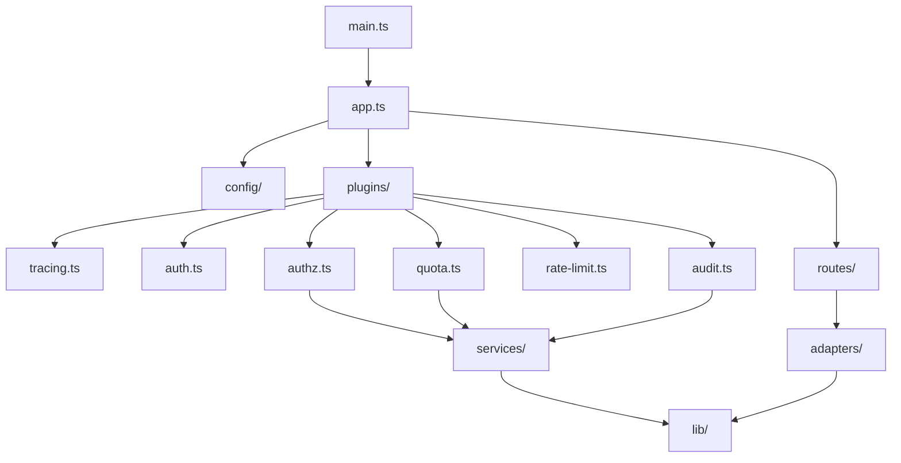

# AgentifUI Gateway 仓库结构

* **规范版本**：v0.1
* **最后更新**：2026-01-27
* **状态**：草稿

---

## 1. 概述

本文档定义 AgentifUI Gateway 独立项目的目录结构规范。

### 设计原则

| 原则 | 说明 |
|------|------|
| **插件化** | 每个功能模块独立成插件，可按需启用 |
| **分层清晰** | 插件 → 中间件 → 路由 → 适配器 |
| **配置驱动** | 行为通过配置控制，减少代码分支 |
| **可测试** | 每个模块独立测试，无隐式依赖 |

---

## 2. 目录结构

```
agentifui-gateway/
├── .github/
│   ├── workflows/
│   │   ├── ci.yml              # PR 检查
│   │   ├── release.yml         # 版本发布
│   │   └── docker.yml          # Docker 构建
│   └── PULL_REQUEST_TEMPLATE.md
├── docker/
│   ├── Dockerfile              # 生产镜像
│   ├── Dockerfile.dev          # 开发镜像
│   └── docker-compose.yml      # 本地开发
├── docs/
│   └── README.md               # → 链接到 agentifui-docs/gateway/
├── src/
│   ├── app.ts                  # Fastify 应用入口
│   ├── main.ts                 # 服务启动入口
│   ├── config/
│   │   ├── index.ts            # 配置加载
│   │   ├── schema.ts           # 配置 Schema (Zod)
│   │   └── defaults.ts         # 默认配置
│   ├── plugins/                # Fastify 插件 (按优先级)
│   │   ├── tracing.ts          # P0: Trace ID 生成
│   │   ├── health.ts           # P5: 健康检查
│   │   ├── auth.ts             # P10: 认证
│   │   ├── tenant.ts           # P20: 租户上下文
│   │   ├── authz.ts            # P30: 授权
│   │   ├── quota.ts            # P40: 配额
│   │   ├── rate-limit.ts       # P50: 限流
│   │   ├── audit.ts            # P100: 审计 (后置)
│   │   └── index.ts            # 按优先级注册
│   ├── routes/
│   │   ├── v1/
│   │   │   ├── chat.ts         # POST /v1/chat/completions
│   │   │   ├── models.ts       # GET /v1/models
│   │   │   └── index.ts
│   │   └── internal/
│   │       └── metrics.ts      # GET /metrics (Prometheus)
│   ├── adapters/               # 后端适配器
│   │   ├── types.ts            # 适配器接口
│   │   ├── dify.ts             # Dify 适配器
│   │   ├── coze.ts             # Coze 适配器
│   │   ├── n8n.ts              # n8n 适配器
│   │   ├── openai.ts           # OpenAI 透传
│   │   └── index.ts            # 适配器工厂
│   ├── services/               # 内部服务调用
│   │   ├── core-api.ts         # Core API 客户端
│   │   ├── authz.ts            # 授权服务
│   │   ├── quota.ts            # 配额服务
│   │   └── audit.ts            # 审计服务
│   ├── lib/
│   │   ├── errors.ts           # 错误定义
│   │   ├── sse.ts              # SSE 处理
│   │   ├── trace.ts            # Trace 工具
│   │   └── logger.ts           # 日志配置
│   └── types/
│       ├── fastify.d.ts        # Fastify 类型扩展
│       ├── api.ts              # API 类型
│       └── index.ts
├── test/
│   ├── unit/
│   │   ├── plugins/
│   │   └── adapters/
│   ├── integration/
│   │   └── routes/
│   ├── e2e/
│   │   └── chat.e2e.test.ts
│   └── fixtures/
│       ├── jwt.ts
│       └── mock-backend.ts
├── scripts/
│   ├── dev.sh                  # 本地开发启动
│   └── build.sh                # 构建脚本
├── .env.example
├── .eslintrc.js
├── .prettierrc
├── .gitignore
├── package.json
├── tsconfig.json
├── vitest.config.ts            # 测试配置
└── README.md
```

---

## 3. 核心目录说明

### 3.1 Plugins 目录

每个插件文件导出一个 Fastify 插件：

```typescript
// src/plugins/auth.ts
import fp from 'fastify-plugin';
import type { FastifyPluginAsync } from 'fastify';

const authPlugin: FastifyPluginAsync = async (fastify) => {
  fastify.decorateRequest('user', null);
  
  fastify.addHook('preHandler', async (request, reply) => {
    const token = request.headers.authorization?.replace('Bearer ', '');
    if (!token) {
      return reply.code(401).send({ error: 'Unauthorized' });
    }
    request.user = await verifyToken(token);
  });
};

export default fp(authPlugin, {
  name: 'auth',
  dependencies: ['tracing']  // 声明依赖
});
```

### 3.2 Adapters 目录

适配器实现统一接口：

```typescript
// src/adapters/types.ts
export interface BackendAdapter {
  name: string;
  
  chat(
    request: ChatRequest,
    signal?: AbortSignal
  ): AsyncIterable<SSEEvent>;
  
  stop(taskId: string): Promise<StopResult>;
  
  listModels(): Promise<Model[]>;
}

// src/adapters/dify.ts
export class DifyAdapter implements BackendAdapter {
  name = 'dify';
  
  async *chat(request: ChatRequest): AsyncIterable<SSEEvent> {
    const difyRequest = this.transformRequest(request);
    const response = await fetch(this.baseUrl + '/chat-messages', {
      method: 'POST',
      body: JSON.stringify(difyRequest),
      headers: { 'Authorization': `Bearer ${this.apiKey}` }
    });
    
    for await (const event of parseSSE(response.body)) {
      yield this.transformEvent(event);
    }
  }
  
  // ...
}
```

### 3.3 Services 目录

封装对 Core API 的调用：

```typescript
// src/services/core-api.ts
export class CoreApiClient {
  constructor(private config: CoreApiConfig) {}
  
  async checkAuthz(request: AuthzRequest): Promise<AuthzResponse> {
    return this.post('/internal/authz', request);
  }
  
  async checkQuota(request: QuotaRequest): Promise<QuotaResponse> {
    return this.post('/internal/quota/check', request);
  }
  
  async sendAudit(event: AuditEvent): Promise<void> {
    // Fire and forget, with retry
    this.post('/internal/audit', event).catch(this.handleAuditError);
  }
  
  private async post<T>(path: string, body: unknown): Promise<T> {
    const response = await fetch(this.config.baseUrl + path, {
      method: 'POST',
      headers: {
        'Content-Type': 'application/json',
        'X-Internal-Token': this.config.internalToken
      },
      body: JSON.stringify(body)
    });
    
    if (!response.ok) {
      throw new CoreApiError(response.status, await response.text());
    }
    
    return response.json();
  }
}
```

---

## 4. 配置文件

### 4.1 package.json

```json
{
  "name": "@agentifui/gateway",
  "version": "0.1.0",
  "type": "module",
  "scripts": {
    "dev": "tsx watch src/main.ts",
    "build": "tsup src/main.ts --format esm --dts",
    "start": "node dist/main.js",
    "test": "vitest",
    "test:e2e": "vitest --project e2e",
    "lint": "oxlint && eslint src",
    "typecheck": "tsc --noEmit"
  },
  "dependencies": {
    "fastify": "^5.0.0",
    "@fastify/cors": "^10.0.0",
    "@fastify/helmet": "^12.0.0",
    "@fastify/jwt": "^9.0.0",
    "@fastify/rate-limit": "^10.0.0",
    "@fastify/http-proxy": "^10.0.0",
    "@fastify/under-pressure": "^9.0.0",
    "@opentelemetry/sdk-node": "^0.52.0",
    "@opentelemetry/instrumentation-fastify": "^0.37.0",
    "pino": "^9.0.0",
    "zod": "^3.23.0"
  },
  "devDependencies": {
    "typescript": "^5.6.0",
    "tsx": "^4.0.0",
    "tsup": "^8.0.0",
    "vitest": "^2.0.0",
    "@types/node": "^22.0.0",
    "oxlint": "^0.9.0",
    "eslint": "^9.0.0"
  }
}
```

### 4.2 tsconfig.json

```json
{
  "compilerOptions": {
    "target": "ES2022",
    "module": "ESNext",
    "moduleResolution": "bundler",
    "strict": true,
    "esModuleInterop": true,
    "skipLibCheck": true,
    "outDir": "dist",
    "rootDir": "src",
    "declaration": true,
    "declarationMap": true,
    "sourceMap": true,
    "paths": {
      "@/*": ["./src/*"]
    }
  },
  "include": ["src"],
  "exclude": ["node_modules", "dist", "test"]
}
```

### 4.3 Docker Compose (开发)

```yaml
# docker/docker-compose.yml
version: '3.8'

services:
  gateway:
    build:
      context: ..
      dockerfile: docker/Dockerfile.dev
    ports:
      - "4000:4000"
    environment:
      - NODE_ENV=development
      - CORE_API_URL=http://core-api:3000
      - JWT_SECRET=dev-secret
      - DIFY_API_URL=http://dify-api:5001
    volumes:
      - ../src:/app/src
    depends_on:
      - redis
      - mock-backend
  
  redis:
    image: redis:7-alpine
    ports:
      - "6379:6379"
  
  mock-backend:
    build:
      context: ../test/fixtures
      dockerfile: Dockerfile.mock
    ports:
      - "5001:5001"
```

---

## 5. 开发工作流

### 5.1 本地开发

```bash
# 克隆仓库
git clone https://github.com/agentifui/gateway.git
cd gateway

# 安装依赖
pnpm install

# 复制环境文件
cp .env.example .env

# 启动开发服务器
pnpm dev

# 或使用 Docker Compose
cd docker && docker-compose up
```

### 5.2 测试

```bash
# 单元测试
pnpm test

# 集成测试
pnpm test:integration

# E2E 测试
pnpm test:e2e

# 覆盖率报告
pnpm test -- --coverage
```

### 5.3 构建与发布

```bash
# 构建
pnpm build

# 本地验证
pnpm start

# Docker 构建
docker build -t agentifui-gateway:latest -f docker/Dockerfile .
```

---

## 6. CI/CD 流程

### 6.1 PR 检查 (ci.yml)

```yaml
name: CI

on:
  pull_request:
    branches: [main]

jobs:
  check:
    runs-on: ubuntu-latest
    steps:
      - uses: actions/checkout@v4
      - uses: pnpm/action-setup@v3
      - uses: actions/setup-node@v4
        with:
          node-version: '22'
          cache: 'pnpm'
      - run: pnpm install
      - run: pnpm lint
      - run: pnpm typecheck
      - run: pnpm test -- --coverage
      - run: pnpm build
```

### 6.2 发布流程 (release.yml)

```yaml
name: Release

on:
  push:
    tags:
      - 'v*'

jobs:
  release:
    runs-on: ubuntu-latest
    steps:
      - uses: actions/checkout@v4
      - uses: pnpm/action-setup@v3
      - uses: actions/setup-node@v4
        with:
          node-version: '22'
          registry-url: 'https://registry.npmjs.org'
      - run: pnpm install
      - run: pnpm build
      - run: pnpm publish --access public
        env:
          NODE_AUTH_TOKEN: ${{ secrets.NPM_TOKEN }}
```

---

## 附录 A：模块依赖图



---

## 附录 B：版本历史

| 版本 | 日期 | 变更内容 |
|------|------|----------|
| v0.1 | 2026-01-27 | 初始版本 |
