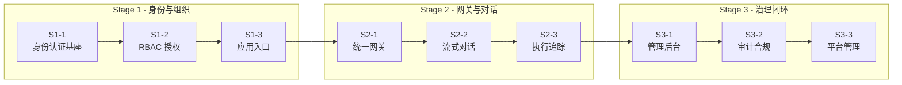

# AgentifUI Phase 1 Backlog 切片定义

* **版本**：v0.1
* **最后更新**：2026-01-27
* **关联文档**：
  - [ROADMAP_V1_0.md](./ROADMAP_V1_0.md) - 详细 Stage/Slice 定义
  - [PHASE1_ACCEPTANCE.md](./PHASE1_ACCEPTANCE.md) - 验收标准

---

## 1. 概述

本文档定义 Phase 1（v1.0）的 **端到端切片（Slices）**，是 FRD 生成和开发任务的输入。

### 切片原则

1. **一个切片 = 一条可验收的端到端路径**
2. 切片按开发顺序排列，后续切片可能依赖前置切片
3. 每个切片有明确的 Feature ID 映射和验收映射

---

## 2. 切片依赖关系图

---

## 3. Stage 1 切片定义

### S1-1：多租户身份认证基座

| 属性 | 值 |
|------|-----|
| **切片 ID** | S1-1 |
| **切片名称** | 多租户身份认证基座 |
| **依赖切片** | 无（首个切片） |
| **预估工时** | ~8h（FRD 2h + 实现 6h） |

#### Feature ID 映射

| Feature ID | 名称 | 优先级 |
|------------|------|--------|
| F-ORG-001 | 多租户隔离与治理单元 | P0 |
| F-ORG-002 | 群组组织与成员归属 | P0 |
| F-ORG-003 | 多群组成员与管理者绑定 | P0 |
| F-AUTH-001 | 多认证方式登录 | P0 |
| F-AUTH-002 | 基于邮箱域名的 SSO 自动识别 | P0 |
| F-AUTH-003 | JIT 用户创建与入驻 | P1 |
| F-AUTH-004 | 用户状态与审核流 | P1 |
| F-AUTH-005 | 密码策略管理 | P0 |
| F-AUTH-006 | MFA（TOTP）与租户级策略 | P1 |
| F-AUTH-007 | 用户资料与偏好设置 | P1 |
| F-AUTH-008 | 用户邀请与激活链接 | P1 |

#### 验收映射

| 验收条目 | AC ID |
|----------|-------|
| 用户可通过邮箱密码完成登录 | AC-S1-1-01 |
| SSO 域名识别响应时间 ≤500ms | AC-S1-1-02 |
| 登录/登出事件写入审计日志 | AC-S1-1-08 |

#### 接口冻结点

启动会通过后冻结：
- `DOMAIN_MODEL_P1.md` 中 `Tenant`, `Group`, `User` 实体字段
- `GATEWAY_CONTRACT_P1.md` 中 `/auth/*` 相关接口

#### DoD（完成定义）

- [ ] 邮箱密码登录端到端可用
- [ ] SSO 域名识别 P95 ≤ 500ms
- [ ] 审计日志覆盖登录/登出
- [ ] 单元测试覆盖率 ≥ 80%

---

### S1-2：RBAC 与授权模型

| 属性 | 值 |
|------|-----|
| **切片 ID** | S1-2 |
| **切片名称** | RBAC 与授权模型 |
| **依赖切片** | S1-1 |
| **预估工时** | ~8h（FRD 2h + 实现 6h） |

#### Feature ID 映射

| Feature ID | 名称 | 优先级 |
|------------|------|--------|
| F-IAM-001 | 角色体系（RBAC） | P0 |
| F-IAM-002 | Break-glass 紧急访问机制 | P1 |
| F-IAM-003 | 应用访问授权（群组→应用） | P0 |
| F-IAM-004 | 用户直授例外授权 | P1 |
| F-IAM-005 | 授权优先级与显式拒绝 | P0 |
| F-IAM-006 | 多群组权限合并与归因 | P0 |
| F-IAM-007 | 内容可见性边界 | P0 |
| F-IAM-008 | 智能上下文切换 | P1 |

#### 验收映射

| 验收条目 | AC ID |
|----------|-------|
| 权限判定延迟 ≤50ms | AC-S1-2-01 |
| 四级角色体系生效 | AC-S1-2-02 |
| 多群组权限合并正确 | AC-S1-2-07 |

#### 接口冻结点

启动会通过后冻结：
- `DOMAIN_MODEL_P1.md` 中 `Role`, `Permission`, `UserRole`, `AppGrant` 实体字段

#### DoD（完成定义）

- [ ] 权限判定 P95 ≤ 50ms
- [ ] 四级角色权限分离正确
- [ ] 多群组权限合并逻辑正确
- [ ] Break-glass 操作产生 Critical 审计

---

### S1-3：应用入口与工作台

| 属性 | 值 |
|------|-----|
| **切片 ID** | S1-3 |
| **切片名称** | 应用入口与工作台 |
| **依赖切片** | S1-2 |
| **预估工时** | ~6h（FRD 1h + 实现 5h） |

#### Feature ID 映射

| Feature ID | 名称 | 优先级 |
|------------|------|--------|
| F-APP-001 | AI 应用目录与选择入口 | P0 |
| F-APP-004 | 应用发现与工作台 | P0 |
| F-QUOTA-001 | 多层级配额管理 | P0 |
| F-QUOTA-002 | Token 计量与计费口径 | P1 |
| F-QUOTA-003 | 配额超限拦截 | P0 |
| F-QUOTA-004 | 配额阈值告警 | P1 |

#### 验收映射

| 验收条目 | AC ID |
|----------|-------|
| 应用列表正确展示授权应用 | AC-S1-3-01 |
| 配额检查拦截超限请求 | AC-S1-3-04 |
| 配额告警触发 | AC-S1-3-05 |

#### 接口冻结点

启动会通过后冻结：
- `DOMAIN_MODEL_P1.md` 中 `App`, `Quota` 实体字段

#### DoD（完成定义）

- [ ] 授权应用列表正确展示
- [ ] 配额超限拦截率 100%
- [ ] 配额告警延迟 ≤ 5min

---

## 4. Stage 2 切片定义

### S2-1：统一网关最小协议

| 属性 | 值 |
|------|-----|
| **切片 ID** | S2-1 |
| **切片名称** | 统一网关最小协议 |
| **依赖切片** | S1-3 |
| **预估工时** | ~8h（FRD 2h + 实现 6h） |

#### Feature ID 映射

| Feature ID | 名称 | 优先级 |
|------------|------|--------|
| F-GW-001 | OpenAI API 兼容的统一调用入口 | P0 |
| F-GW-002 | 统一错误处理与响应结构一致性 | P0 |
| F-GW-003 | 会话主键统一生成与映射管理 | P0 |
| F-GW-004 | 能力降级与只读可用性保障 | P0 |
| F-GW-005 | 身份与凭证传递边界 | P0 |
| F-OBS-001 | Trace ID 全链路关联与展示 | P0 |
| F-OBS-002 | 外部观测平台跳转 | P1 |

#### DoD（完成定义）

- [ ] OpenAI 兼容 API 可调通
- [ ] SSE 流式响应正常
- [ ] Trace ID 100% 注入
- [ ] 编排不可用时降级正常

---

### S2-2：流式对话与执行追踪

| 属性 | 值 |
|------|-----|
| **切片 ID** | S2-2 |
| **切片名称** | 流式对话与执行追踪 |
| **依赖切片** | S2-1 |
| **预估工时** | ~12h（FRD 3h + 实现 9h） |

#### Feature ID 映射

| Feature ID | 名称 | 优先级 |
|------------|------|--------|
| F-CHAT-001 | 实时文本对话 | P0 |
| F-CHAT-002 | 流式响应展示 | P0 |
| F-CHAT-003 | 数学公式渲染 | P1 |
| F-CHAT-004 | AI 推荐下一问题 | P2 |
| F-CHAT-005 | 停止生成 | P0 |
| F-CHAT-006 | 对话会话管理 | P0 |
| F-CHAT-007 | 对话只读分享链接 | P1 |
| F-CHAT-008 | 消息交互与反馈 | P1 |
| F-FILE-001 | 文件上传/下载/预览 | P1 |
| F-ART-001 | Artifacts 产物管理与预览 | P2 |
| F-HITL-001 | Human-in-the-loop 结构化交互 | P2 |

#### DoD（完成定义）

- [ ] 完整对话端到端成功
- [ ] 首 Token P95 ≤ 1.5s
- [ ] 停止生成 ≤ 500ms 停止渲染
- [ ] 50MB 文件上传 P95 ≤ 10s

---

### S2-3：执行状态与数据持久化

| 属性 | 值 |
|------|-----|
| **切片 ID** | S2-3 |
| **切片名称** | 执行状态与数据持久化 |
| **依赖切片** | S2-2 |
| **预估工时** | ~8h（FRD 2h + 实现 6h） |

#### Feature ID 映射

| Feature ID | 名称 | 优先级 |
|------------|------|--------|
| F-APP-002 | 运行 Agent/Workflow | P0 |
| F-APP-003 | RAG 引用结果展示 | P1 |
| F-RUN-001 | Run 类型统一入口 | P0 |
| F-RUN-002 | 执行状态展示 | P0 |
| F-RUN-003 | 执行详情与失败原因呈现 | P0 |
| F-DATA-001 | 会话与执行数据本地持久化 | P0 |
| F-DATA-002 | 数据回源同步与降级 | P1 |
| F-SEC-001 | 提示词注入检测策略 | P1 |
| F-SEC-002 | 会话隔离与应用上下文隔离 | P0 |

#### DoD（完成定义）

- [ ] Run 状态变更 ≤ 3s 反映到 UI
- [ ] 100% Run 包含 Trace ID
- [ ] 会话数据持久化成功
- [ ] 会话隔离正确

---

## 5. Stage 3 切片定义

> Stage 3 切片详细定义见 [ROADMAP_V1_0.md](./ROADMAP_V1_0.md#stage-3--治理闭环与可运营)，此处仅列出要点。

### S3-1：管理后台核心闭环

- **Feature 数量**：13 个
- **预估工时**：~10h
- **核心能力**：用户/群组/应用/授权/配额管理 CRUD

### S3-2：审计与安全合规闭环

- **Feature 数量**：11 个
- **预估工时**：~8h
- **核心能力**：审计日志、PII 去敏、合规策略

### S3-3：平台管理与用户体验完善

- **Feature 数量**：18 个
- **预估工时**：~10h
- **核心能力**：ROOT ADMIN、多语言、Webhook、高可用

---

## 6. 开发顺序汇总

| 序号 | 切片 ID | 名称 | 预估工时 | 累计工时 |
|------|---------|------|----------|----------|
| 1 | S1-1 | 身份认证基座 | 8h | 8h |
| 2 | S1-2 | RBAC 授权 | 8h | 16h |
| 3 | S1-3 | 应用入口 | 6h | 22h |
| 4 | S2-1 | 统一网关 | 8h | 30h |
| 5 | S2-2 | 流式对话 | 12h | 42h |
| 6 | S2-3 | 执行追踪 | 8h | 50h |
| 7 | S3-1 | 管理后台 | 10h | 60h |
| 8 | S3-2 | 审计合规 | 8h | 68h |
| 9 | S3-3 | 平台管理 | 10h | 78h |

**Phase 1 总预估**：~78h（不含测试和文档）

---

## 7. 切片状态追踪

| 切片 ID | 状态 | FRD | 实现 | 测试 |
|---------|------|-----|------|------|
| S1-1 | 🔲 待开始 | - | - | - |
| S1-2 | 🔲 待开始 | - | - | - |
| S1-3 | 🔲 待开始 | - | - | - |
| S2-1 | 🔲 待开始 | - | - | - |
| S2-2 | 🔲 待开始 | - | - | - |
| S2-3 | 🔲 待开始 | - | - | - |
| S3-1 | 🔲 待开始 | - | - | - |
| S3-2 | 🔲 待开始 | - | - | - |
| S3-3 | 🔲 待开始 | - | - | - |

**状态图例**：
- 🔲 待开始
- 🔵 进行中
- ✅ 已完成
- ❌ 阻塞

---

## 附录 A：Feature ID 完整清单

详见 [ROADMAP_V1_0.md 附录](./ROADMAP_V1_0.md#附录feature-id-阶段分布)。

---

*文档结束*
