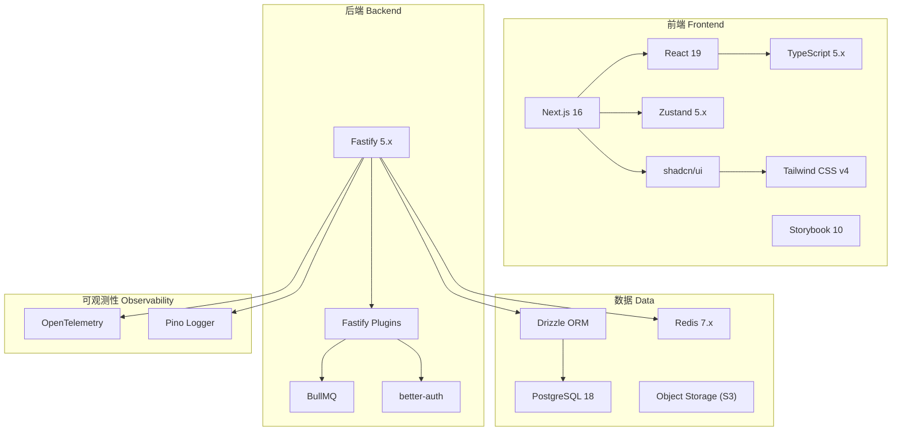

# AgentifUI 技术选型

* **规范版本**：v0.4
* **最后更新**：2026-01-27
* **状态**：已确认
* **参考**：Dify / LobeChat / LibreChat / Platformatic (Fastify 最佳实践) / agentifui-pro

---

## 1. 概述

本文档记录 AgentifUI 项目的技术选型决策，作为 Phase 1 开发的技术基线。

### 设计原则

1. **TypeScript 全栈**：前后端统一语言，减少上下文切换
2. **现代化工具链**：选择活跃维护、社区成熟的工具
3. **可观测性优先**：OpenTelemetry 原生集成
4. **企业级就绪**：支持多租户、RBAC、审计

---

## 2. 技术栈总览



---

## 3. 前端技术栈

### 3.1 框架与运行时

| 技术 | 版本 | 用途 | 选型理由 |
|------|------|------|----------|
| **Next.js** | 16 | 全栈 React 框架 | App Router、RSC、SSR/SSG、Turbopack |
| **React** | 19 | UI 库 | Server Components、并发渲染、React Compiler |
| **TypeScript** | 5 | 类型系统 | 全栈类型安全 |

### 3.2 UI 与样式

| 技术 | 版本 | 用途 | 选型理由 |
|------|------|------|----------|
| **shadcn/ui** | - | UI 组件库 | 可定制、无运行时依赖、基于 Radix |
| **Tailwind CSS** | 4 | 原子化 CSS | 零配置、更快编译、更小体积 |
| **Lucide Icons** | - | 图标库 | 与 shadcn/ui 默认集成 |

> [!NOTE]
> **待验证**：shadcn/ui 原基于 Tailwind v3，与 Tailwind v4 的兼容性需在开发时实测，如遇问题可临时降级。

### 3.3 状态管理与数据获取

| 技术 | 用途 | 选型理由 |
|------|------|----------|
| **Zustand** | 客户端状态管理 | 轻量、TypeScript 友好、无样板代码 |
| **TanStack Query** | 服务端状态/数据获取 | 缓存、乐观更新、自动重获取 |
| **TRPC** | 类型安全 API 调用 | 参考 LobeChat（可选，用于复杂前后端交互） |

**Zustand Slices 模式**（参考 LobeChat）：

```typescript
// 模块化 Store 结构
src/store/
├── chat/
│   ├── slices/
│   │   ├── message/      # 消息 CRUD
│   │   ├── topic/        # 话题管理
│   │   └── aiChat/       # AI 对话逻辑
│   ├── store.ts          # Store 聚合
│   └── selectors.ts      # 选择器
├── user/
└── global/
```

### 3.4 国际化

| 技术 | 用途 | 选型理由 |
|------|------|----------|
| **next-intl** | i18n | Next.js App Router 原生支持 |

### 3.5 参考项目

- **LobeChat**：shadcn/ui + Zustand + TanStack Query
- **Dify Web**：Next.js App Router，但使用 Tailwind + 自定义组件

---

## 4. 后端技术栈

### 4.1 运行时与框架

| 技术 | 版本 | 用途 | 选型理由 |
|------|------|------|----------|
| **Node.js** | 22 LTS | JavaScript 运行时 | 与前端统一语言、生态成熟 |
| **Fastify** | 5 | Web 框架 | 高性能（~3MB 依赖体积）、插件化、JSON Schema 验证、内置 Pino 日志 |

### 4.2 认证与授权

| 技术 | 用途 | 选型理由 |
|------|------|----------|
| **better-auth** | 认证系统 | 开源、灵活、支持多种认证方式 |
| **自建 RBAC** | 授权系统 | 满足 PRD 复杂授权需求 |

**better-auth 支持的认证方式**：

- 邮箱 + 密码
- OAuth2 (Google, GitHub, 飞书等)
- OIDC / SAML 2.0 / CAS
- TOTP MFA

### 4.3 异步任务队列

| 技术 | 用途 | 选型理由 |
|------|------|----------|
| **BullMQ** | 任务队列 | Redis-based、Node.js 原生、支持重试/延迟/优先级 |

**任务类型**：

- 审计日志异步写入
- Webhook 投递与重试
- 配额统计聚合
- 文件清理

### 4.4 Gateway 插件清单

> [!NOTE]
> Gateway 作为独立项目开发，详细插件配置见 [Gateway 架构设计](../gateway/ARCHITECTURE.md)。

| 插件 | 用途 | 说明 |
|------|------|------|
| **@fastify/cors** | 跨域处理 | 官方插件 |
| **@fastify/rate-limit** | 请求限流 | 支持 Redis 后端 |
| **@fastify/jwt** | JWT 验证 | 与 better-auth 配合 |
| **@fastify/helmet** | 安全头 | 官方插件 |
| **@fastify/under-pressure** | 健康检查 + 压力监控 | 自动暴露 `/status` 端点 |
| **@fastify/http-proxy** | 后端编排平台代理 | 支持 WebSocket、Header 重写 |
| **@fastify/error** | 类型化错误工厂 | 统一错误码前缀 `AFUI_GATEWAY_xxx` |
| **@opentelemetry/instrumentation-fastify** | OpenTelemetry 追踪 | 自动 Span 注入 |

> [!TIP]
> Phase 1 采用 Fastify + 插件轻量路线，保留后续平滑升级到 Platformatic 的可能性（如需复杂配置管理或多服务编排）。

### 4.5 参考项目

- **Dify API**：Flask + Celery，作为业务逻辑参考
- **LibreChat**：Node.js + Express，作为 OpenAI 兼容 API 参考

---

## 5. 数据层

### 5.1 关系数据库

| 技术 | 版本 | 用途 | 选型理由 |
|------|------|------|----------|
| **PostgreSQL** | 18 | 主数据库 | 原生 `uuidv7()` 支持、性能提升、JSON 增强 |
| **Drizzle ORM** | - | ORM | 类型安全、SQL-like、性能优 |

> [!TIP]
> PostgreSQL 18 原生支持 `uuidv7()` 函数生成时间有序 UUID，避免 B-tree 索引碎片，提升写入性能。

**Drizzle vs 其他 ORM**：

| 特性 | Drizzle | Prisma | TypeORM |
|------|---------|--------|---------|
| 类型安全 | ✅ 原生 | ✅ 生成 | ⚠️ 运行时 |
| SQL 相似度 | ✅ 高 | ❌ 低 | ⚠️ 中 |
| Bundle 大小 | ✅ 小 | ❌ 大 | ⚠️ 中 |
| 迁移工具 | ✅ drizzle-kit | ✅ prisma migrate | ⚠️ 较弱 |

### 5.2 缓存与会话

| 技术 | 用途 |
|------|------|
| **Redis** | 会话存储、权限缓存、配额计数、限流、BullMQ 后端 |

### 5.3 对象存储

| 技术 | 用途 |
|------|------|
| **S3 兼容存储** | 上传文件、Artifacts、导出文件 |

支持：AWS S3 / MinIO / Cloudflare R2

---

## 6. 可观测性

### 6.1 追踪与日志

| 技术 | 用途 | 选型理由 |
|------|------|----------|
| **OpenTelemetry** | 分布式追踪 | @opentelemetry/instrumentation-fastify、W3C 标准 |
| **Pino** | 结构化日志 | Fastify 默认、高性能 |

**OpenTelemetry 配置模式**（参考 Semantic Conventions）：

```typescript
// Span 属性命名规范
const spanAttributes = {
  request: {
    'server.address': hostname,
    'http.request.method': method,
    'url.full': fullUrl,
    'url.path': path,
    'http.route': route,
  },
  reply: {
    'http.response.status_code': statusCode,
  },
  error: {
    'error.name': error.name,
    'error.message': error.message,
    'error.stack': error.stack,
  }
};
```

**支持的导出器**：
- OTLP (OpenTelemetry Protocol) - 支持 Jaeger/Grafana
- Zipkin
- Console (开发调试)
- Memory (测试)

### 6.2 外部集成

**支持的观测平台**：

- Jaeger (自托管)
- SigNoz (开源)
- Grafana Cloud
- Datadog / New Relic (商业)
- Langfuse (可选，AI 观测，参考 LobeChat)

---

## 7. 开发工具链

### 7.1 包管理与构建

| 工具 | 用途 |
|------|------|
| **pnpm** | 包管理（Monorepo workspace） |
| **Turborepo** | Monorepo 构建编排 |

### 7.2 代码质量

| 工具 | 用途 | 说明 |
|------|------|------|
| **Oxlint** | 快速预检 Linter | Rust 实现，CI 第一道检查 |
| **ESLint** | 深度代码检查 | Oxlint 通过后再执行 |
| **Prettier** | 代码格式化 | 统一代码风格 |
| **TypeScript** | 类型检查 | 严格模式 |

> [!NOTE]
> 采用 **Oxlint + ESLint 双层 Lint** 策略：Oxlint 作为快速预检（~100x faster），ESLint 作为深度检查，参考 agentifui-pro 实践。

### 7.3 组件开发

| 工具 | 版本 | 用途 |
|------|------|------|
| **Storybook** | 10 | 组件隔离开发、可视化测试、文档生成 |

> [!NOTE]
> **待验证**：Storybook 10 对 Next.js 16 + React 19 的支持需在开发时实测，如遇问题可临时使用 Storybook 9。

### 7.4 测试

| 工具 | 版本 | 用途 | 说明 |
|------|------|------|------|
| **Jest** | 30 | 单元测试/集成测试 | Next.js 官方推荐 |
| **React Testing Library** | - | 组件测试 | 用户行为驱动测试 |
| **happy-dom** | - | 测试环境 | 比 jsdom 更快 |
| **Playwright** | - | E2E 测试 | 跨浏览器端到端测试 |

---

## 8. 部署与运维

### 8.1 容器化

| 技术 | 用途 |
|------|------|
| **Docker** | 容器运行时 |
| **Docker Compose** | 本地开发/单机部署 |
| **Kubernetes** | 生产部署（可选） |

### 8.2 CI/CD

| 平台 | 用途 |
|------|------|
| **GitHub Actions** | CI/CD 流水线 |

> 📖 详细实践规范见 [practices/CI_CD_PRACTICES.md](./practices/CI_CD_PRACTICES.md)

---

## 9. 功能实现依赖

本节补充核心框架之外的功能实现工具库选型，确保对 PRD 和 Feature List 的完整技术覆盖。

### 9.1 邮件服务

| 技术 | 用途 | 选型理由 |
|------|------|----------|
| **Nodemailer** | 事务性邮件发送 | Node.js 原生、支持 SMTP/SES 等多种传输方式 |

**使用场景**：
- 用户邀请激活链接
- 密码重置链接
- 配额告警通知（v2.0+ 可选）

**配置模式**：通过外部邮件服务网关（SMTP）发送，支持配置企业邮件服务器或第三方 SMTP 服务。

### 9.2 内容渲染

| 技术 | 用途 | 选型理由 |
|------|------|----------|
| **react-markdown** | Markdown 渲染 | React 原生、生态丰富 |
| **remark-gfm** | GFM 扩展 | 支持表格、任务列表、删除线等 |
| **rehype-highlight** | 代码高亮 | 基于 highlight.js，语言覆盖广 |
| **KaTeX** | LaTeX 数学公式渲染 | 比 MathJax 更快、体积更小 |

**渲染链路**：`Markdown → remark (parse) → rehype (transform) → React`

### 9.3 实时推送

| 技术 | 用途 | 选型理由 |
|------|------|----------|
| **Server-Sent Events (SSE)** | 流式响应 | HTTP 原生、单向推送、兼容性好 |
| **@fastify/websocket** | 双向通信（备选） | 适用于需要客户端主动推送的场景 |

**使用场景**：
- 对话流式响应（SSE 优先）
- 执行状态实时更新（≤3s 延迟）
- 站内通知推送

> [!NOTE]
> v1.0 优先采用 SSE 实现流式响应，WebSocket 保留用于未来双向交互场景。

### 9.4 沙箱与预览

| 技术 | 用途 | 选型理由 |
|------|------|----------|
| **iframe sandbox** | Artifacts 安全预览 | 浏览器原生隔离、可配置 CSP |
| **Sandpack** | 代码沙箱（可选） | CodeSandbox 开源方案，适合代码类 Artifacts |

**安全策略**：
- 默认启用 `sandbox` 属性限制脚本执行
- Tenant 可配置是否允许可执行内容预览
- 结合 CSP 策略防止 XSS

### 9.5 安全与合规

| 技术 | 用途 | 选型理由 |
|------|------|----------|
| **自建规则引擎** | PII 检测与去敏 | 可控、低延迟、支持自定义规则 |
| **正则匹配 + 关键词库** | 提示词注入检测 | 简单有效、易于迭代 |

**PII 检测规则**（v1.0）：
- 手机号（中国大陆/国际格式）
- 身份证号
- 邮箱地址
- 银行卡号
- 自定义敏感词库（Tenant 可配置）

> [!TIP]
> v2.0+ 可考虑引入 ML 模型增强检测能力，或集成 Presidio 等开源方案。

### 9.6 短信服务

| 技术 | 用途 | 选型理由 |
|------|------|----------|
| **阿里云短信 / 腾讯云短信** | 国内手机号验证 | 国内合规、到达率高 |
| **Twilio** | 国际手机号验证 | 全球覆盖、API 友好 |

**使用场景**：手机号登录验证码

**配置模式**：通过统一短信网关接口抽象，支持多通道切换。

### 9.7 数据导出

| 技术 | 用途 | 选型理由 |
|------|------|----------|
| **exceljs** | Excel 导出 | 支持流式写入、样式丰富 |
| **fast-csv** | CSV 导出 | 高性能、流式处理 |

**使用场景**：
- 统计报表导出（F-ADMIN-ANALYTICS-001）
- 审计日志导出（F-ADMIN-AUDIT-002，10万条 ≤30s）

**实现策略**：
- 大数据量采用流式生成 + S3 存储 + 异步下载链接
- BullMQ 任务队列处理导出请求

### 9.8 图片处理

| 技术 | 用途 | 选型理由 |
|------|------|----------|
| **sharp** | 图片压缩/转换/缩略图 | 高性能（基于 libvips）、Node.js 原生 |

**使用场景**：
- 用户头像上传处理
- 品牌 Logo 上传处理
- 文件预览缩略图生成

**处理规则**：
- 格式：统一转换为 WebP（兼容性回退 JPEG）
- 尺寸：头像 256x256，Logo 最大 512x128
- 质量：80%（可配置）

### 9.9 定时任务

| 技术 | 用途 | 选型理由 |
|------|------|----------|
| **BullMQ Repeat Jobs** | 周期性任务 | 与现有 BullMQ 统一、支持 cron 表达式 |

**使用场景**：
- 配额周期重置（自然月/周）
- 直授权限到期撤销
- 过期文件清理
- 过期通知清理

---

## 10. 不选用的技术（及原因）

| 技术 | 不选原因 |
|------|----------|
| **Python Flask** | 无法与前端统一语言，团队技术栈不匹配 |
| **Prisma** | Bundle 过大，SQL 控制力不足 |
| **Clerk** | 商业服务，私有化部署受限 |
| **Ant Design** | 定制成本高、设计语言与新项目风格不符 |
| **Celery** | Python 生态，与 Node.js 后端不匹配 |

---

## 11. 版本兼容性矩阵

| 组件 | 最低版本 | 推荐版本 |
|------|----------|----------|
| Node.js | 20 | 22 LTS |
| PostgreSQL | 17 | 18 |
| Redis | 7 | 7 |
| pnpm | 10 | 10 |

---

## 附录 A：参考项目技术栈对比

| 项目 | 前端 | 后端 | 数据库 | 认证 |
|------|------|------|--------|------|
| **Dify** | Next.js + React Flow | Python Flask + Celery | PostgreSQL + Redis | 自建 |
| **LobeChat** | Next.js + shadcn/ui + Zustand | Next.js API Routes | PostgreSQL + Drizzle | Clerk |
| **LibreChat** | React + Tailwind + shadcn/ui | Node.js + Express | MongoDB + Redis | 自建 |
| **Platformatic** | - | Fastify | PostgreSQL / SQLite | - |
| **AgentifUI** | Next.js 16 + shadcn/ui + Zustand | Fastify 5 + 官方插件 | PostgreSQL 18 + Drizzle + Redis | better-auth |

---

## 附录 B：相关文档

- [系统边界与职责图](./architecture/SYSTEM_BOUNDARY.md)
- [领域模型 v0](./data-model/DOMAIN_MODEL_P1.md)
- [网关契约 v0](./api-contracts/GATEWAY_CONTRACT_P1.md)
- [审计事件 v0](./security/AUDIT_EVENTS_P1.md)
- [降级矩阵 v0](./architecture/DEGRADATION_MATRIX_P1.md)
- [非功能约束](./practices/NFR_BASELINE.md)
