# AgentifUI 技术架构设计

* **文档版本**：v1.0
* **状态**：设计中
* **最后更新**：2026-01-23
* **依赖文档**：[PRD.md](../../prd/PRD.md)、[PRD_ADMIN.md](../../prd/PRD_ADMIN.md)
* **参考项目**：Dify、LibreChat、LobeChat

---

## 1. 架构概述

### 1.1 设计目标

基于 PRD 定义的产品边界，AgentifUI 技术架构需实现以下核心目标：

| 目标 | 描述 | 技术关键词 |
|------|------|-----------|
| **统一体验** | 屏蔽底层差异，提供一致 AI 交互体验 | Protocol Adapter、SSE 标准化 |
| **企业管控** | 可控、安全、合规的 AI 使用环境 | RBAC、审计、PII 去敏 |
| **治理可视** | 清晰的权限、配额、成本统计与审计 | OpenTelemetry、用量归因 |
| **架构解耦** | 作为中间层解耦前端与 AI 引擎 | 统一网关、多租户隔离 |

### 1.2 架构原则

1. **分层解耦**：前端 → 统一网关 → 后端编排，职责边界清晰
2. **租户隔离优先**：数据隔离在数据层强制执行，无法绕过
3. **可观测性内建**：OpenTelemetry 贯穿全链路，Trace ID 统一生成
4. **平台无关**：后端编排平台可插拔（Dify/Coze/n8n/LangChain）
5. **横向扩展**：无状态设计，支持多副本水平扩展

---

## 2. 系统分层架构

### 2.1 总体架构图

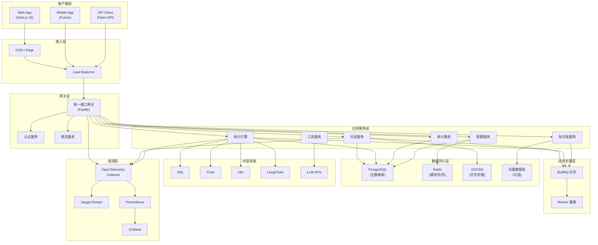

### 2.2 层次职责定义

| 层次 | 职责 | 技术选型 |
|------|------|---------|
| **客户端层** | 交互渲染、状态展示、基础校验、用户反馈 | Next.js 15、Zustand、Radix UI |
| **接入层** | 静态资源分发、负载均衡、TLS 终结 | CDN、Nginx/Envoy |
| **网关层** | 身份鉴权、Trace 生成、协议适配、治理执行 | Fastify 5.x + 官方插件 |
| **应用服务层** | 业务逻辑处理、领域服务编排 | Fastify、TypeScript |
| **异步处理层** | 后台任务、文档索引、通知推送 | BullMQ、Redis |
| **数据持久层** | 数据存储、缓存、文件存储 | PostgreSQL、Redis、S3 |
| **观测层** | 分布式追踪、指标收集、日志聚合 | OpenTelemetry、Jaeger |

---

## 3. 核心组件设计

### 3.1 统一接口网关（Gateway）

> 基于 Fastify 5.x + 官方插件，借鉴 Dify 的 Layer 插件架构 + LibreChat 的双 Token 认证
>
> **设计决策**：Gateway 核心职责是协议代理与治理中间件（AuthN/AuthZ/Quota/Audit/Trace），不涉及直接数据库操作。采用 Fastify + 插件轻量路线，保留后续升级到 Platformatic 的可能性。

#### 3.1.1 职责边界

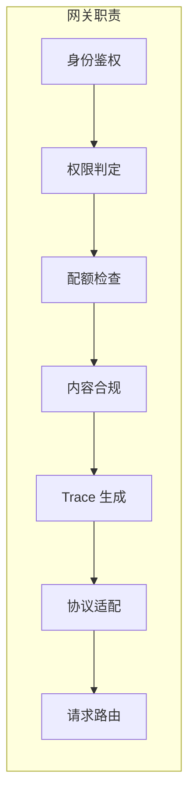

| 职责 | 描述 | 执行时机 |
|------|------|---------|
| **身份鉴权** | JWT 验证、Session 校验、OAuth 回调 | preHandler |
| **权限判定** | RBAC + ACL 权限计算 | preHandler |
| **配额检查** | 配额余量检查与预扣 | preHandler |
| **内容合规** | 提示词注入检测、PII 去敏 | preHandler/onSend |
| **Trace 生成** | 生成 Trace ID 并注入请求上下文 | preHandler |
| **协议适配** | 统一转换为 OpenAI API 规范 | onSend |
| **请求路由** | 路由到对应后端编排平台 | handler |

#### 3.1.2 Fastify 插件清单

| 插件 | 用途 | 执行阶段 |
|------|------|----------|
| **@opentelemetry/instrumentation-fastify** | Trace ID 生成与注入 | onRequest |
| **@fastify/jwt** + **better-auth** | 身份鉴权 | preHandler |
| **@fastify/cors** | 跨域处理 | preHandler |
| **@fastify/helmet** | 安全头 | preHandler |
| **@fastify/rate-limit** | 请求限流 | preHandler |
| **自定义 AuthZ Plugin** | 权限判定 (RBAC + ACL) | preHandler |
| **自定义 Quota Plugin** | 配额检查 | preHandler |
| **自定义 Compliance Plugin** | 内容合规检测 | preHandler |
| **@fastify/under-pressure** | 健康检查 + 压力监控 | - |
| **@fastify/http-proxy** | 后端编排平台代理 | handler |
| **自定义 Audit Plugin** | 审计日志记录 | onResponse |

#### 3.1.3 错误处理模式

借鉴 Platformatic 的 `@fastify/error` 工厂模式：

```typescript
// lib/errors.ts
import createError from '@fastify/error'

export const ERROR_PREFIX = 'AFUI_GATEWAY'

// 类型化错误定义
export const QuotaExceededError = createError(
  `${ERROR_PREFIX}_QUOTA_EXCEEDED`,
  'Quota exceeded for user %s in group %s',
  403
)

export const AppNotAuthorizedError = createError(
  `${ERROR_PREFIX}_APP_NOT_AUTHORIZED`,
  'User %s is not authorized to access app %s',
  403
)

export const ProviderUnavailableError = createError(
  `${ERROR_PREFIX}_PROVIDER_UNAVAILABLE`,
  'Backend provider %s is unavailable',
  503
)

// 确保错误可被 JSON 序列化
export function ensureLoggableError(error: Error) {
  Reflect.defineProperty(error, 'message', { enumerable: true })
  if ('code' in error) {
    Reflect.defineProperty(error, 'code', { enumerable: true })
  }
  if ('stack' in error) {
    Reflect.defineProperty(error, 'stack', { enumerable: true })
  }
  return error
}
```

#### 3.1.4 Layer 抽象设计

借鉴 Dify 的 GraphEngineLayer 设计，实现 Fastify Plugin 封装：

```typescript
// Fastify Plugin 风格的 Layer 抽象
import fp from 'fastify-plugin';

interface GatewayLayerOptions {
  priority: number; // 越小越先执行
}

const tracingLayer = fp(async (fastify, opts: GatewayLayerOptions) => {
  fastify.addHook('onRequest', async (request, reply) => {
    // OpenTelemetry Span 创建
    const span = tracer.startSpan('gateway.request');
    request.traceId = span.spanContext().traceId;
    reply.header('x-trace-id', request.traceId);
  });
}, { name: 'tracing-layer' });

// 按优先级注册 Layers
const layers = [
  { plugin: tracingLayer, priority: 0 },
  { plugin: authenticationLayer, priority: 10 },
  { plugin: authorizationLayer, priority: 20 },
  { plugin: quotaLayer, priority: 30 },
  { plugin: complianceLayer, priority: 40 },
  { plugin: auditLayer, priority: 100 },
];

layers.sort((a, b) => a.priority - b.priority)
  .forEach(({ plugin }) => fastify.register(plugin));
```

#### 3.1.5 认证机制

借鉴 LibreChat 的双 Token 机制：

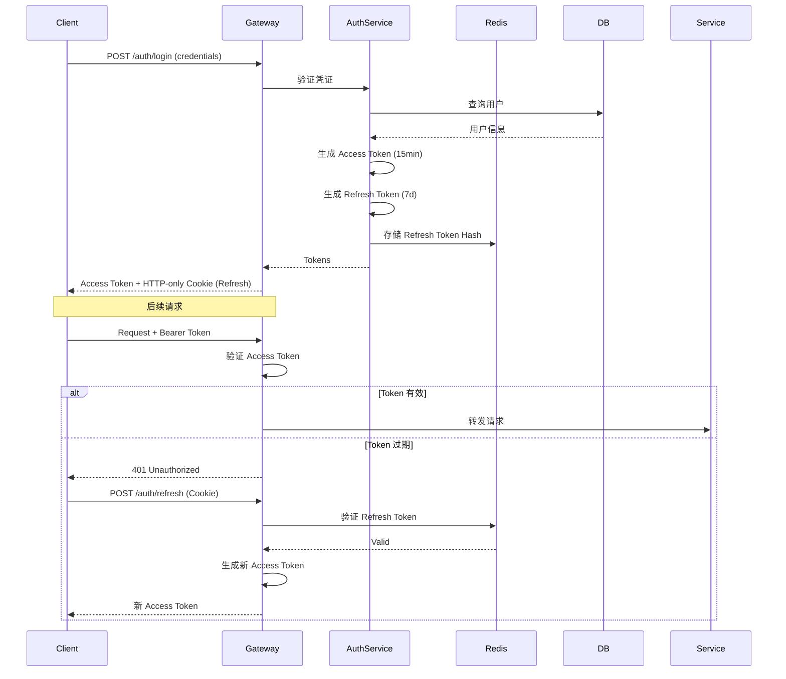

### 3.2 执行引擎（Execution Engine）

> 借鉴 Dify 的 GraphEngine 队列驱动 + LobeChat 的 Operation 系统

#### 3.2.1 执行类型

| Run Type | 描述 | 执行模式 |
|----------|------|---------|
| **GenerationRun** | 单次文本生成 | 同步流式 |
| **AgentRun** | 智能体多轮执行 | 多步循环 |
| **WorkflowRun** | 工作流编排执行 | 节点并行 |

#### 3.2.2 执行状态机

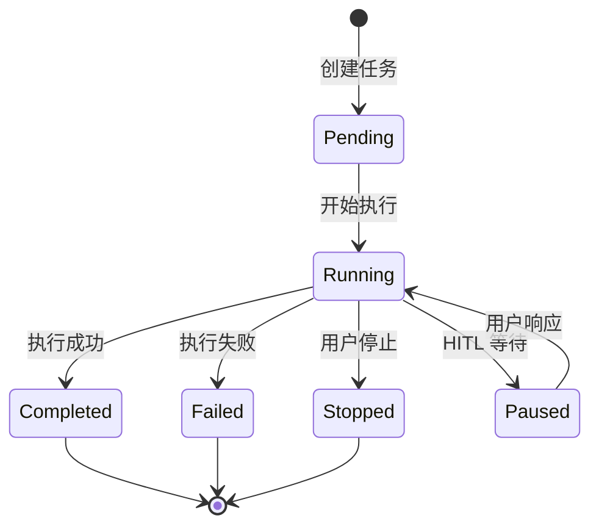

#### 3.2.3 执行运行时状态

借鉴 Dify 的 GraphRuntimeState 设计：

```typescript
interface ExecutionRuntimeState {
  runId: string;
  runType: 'generation' | 'agent' | 'workflow';
  status: ExecutionStatus;

  // 变量池
  variablePool: VariablePool;

  // 执行上下文
  context: {
    tenantId: string;
    userId: string;
    groupId: string;
    appId: string;
    traceId: string;
  };

  // 流式响应协调器
  responseCoordinator: StreamResponseCoordinator;

  // 操作控制（借鉴 LobeChat）
  operation: {
    abortController: AbortController;
    parentOperationId?: string;
    startedAt: Date;
    metadata: Record<string, unknown>;
  };

  // 可序列化支持（用于 Pause/Resume）
  serialize(): SerializedState;
  static deserialize(data: SerializedState): ExecutionRuntimeState;
}
```

#### 3.2.4 工作流执行链路

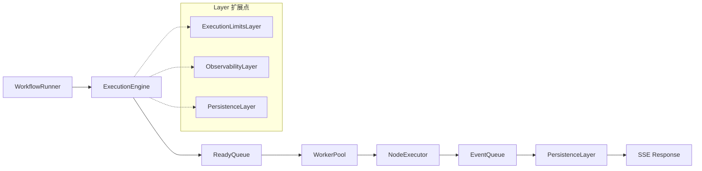

### 3.3 对话服务（Chat Service）

> 借鉴 LobeChat 的 SSE 流式协议 + 平滑动画

#### 3.3.1 流式协议设计

支持 9 种 SSE Chunk 类型（借鉴 LobeChat）：

```typescript
type SSEChunkType =
  | 'text'           // 文本内容
  | 'tool_calls'     // 工具调用
  | 'reasoning'      // 推理过程
  | 'content_part'   // 多模态内容片段
  | 'base64_image'   // 图片数据
  | 'grounding'      // RAG 引用来源
  | 'usage'          // Token 用量
  | 'speed'          // 生成速度
  | 'stop';          // 结束标记

interface SSEEvent {
  event: SSEChunkType;
  data: string; // JSON 序列化
  id?: string;
  retry?: number;
}
```

#### 3.3.2 消息持久化

借鉴 LibreChat 的对话/消息分离存储：

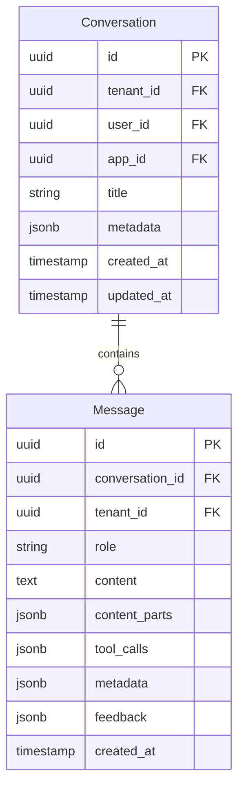

### 3.4 工具与集成服务（Tool Service）

> 借鉴 Dify 的 Tool Provider 体系

#### 3.4.1 Provider 类型

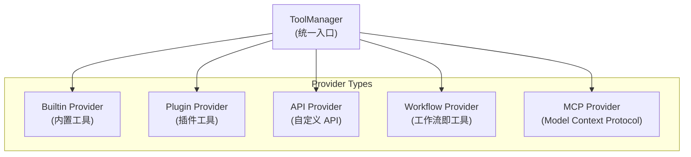

#### 3.4.2 工具执行流程

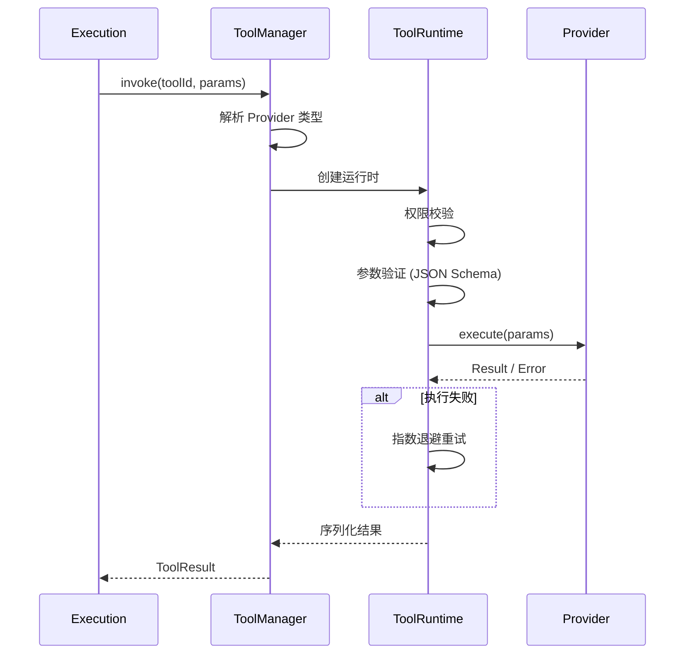

---

## 4. 多租户与数据隔离

### 4.1 租户模型

> 借鉴 Dify 的 Repository 强制隔离 + LibreChat 的权限模型

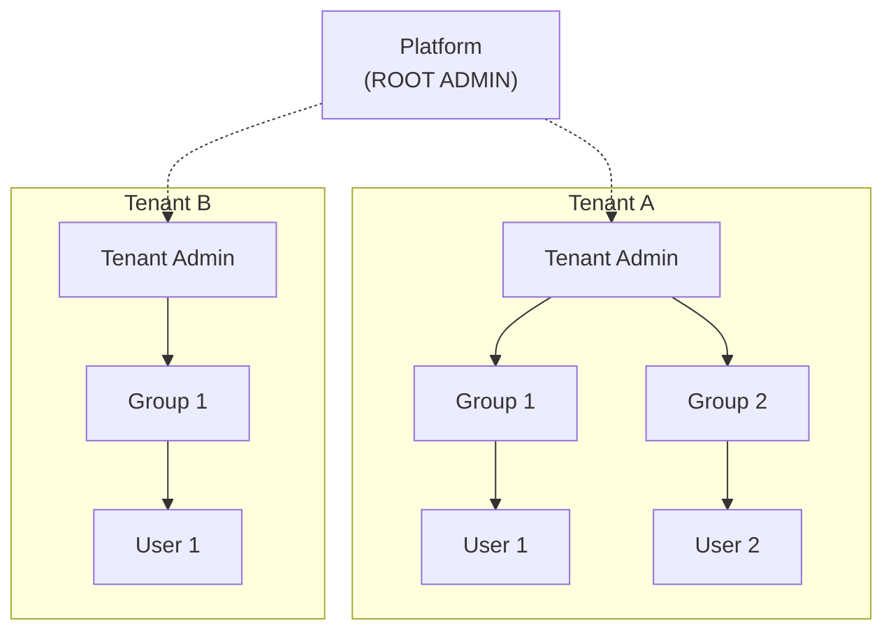

### 4.2 数据隔离策略

#### 4.2.1 Repository 层强制隔离

借鉴 Dify 的 Repository 协议：

```typescript
// 所有 Repository 方法签名必须包含 tenantId
interface BaseRepository<T> {
  findById(tenantId: string, id: string): Promise<T | null>;
  findMany(tenantId: string, query: QueryOptions): Promise<T[]>;
  create(tenantId: string, data: CreateInput): Promise<T>;
  update(tenantId: string, id: string, data: UpdateInput): Promise<T>;
  delete(tenantId: string, id: string): Promise<void>;
}

// 租户上下文传递（使用 AsyncLocalStorage）
class TenantContext {
  private static storage = new AsyncLocalStorage<{ tenantId: string }>();

  static run<T>(tenantId: string, fn: () => T): T {
    return this.storage.run({ tenantId }, fn);
  }

  static getTenantId(): string {
    const ctx = this.storage.getStore();
    if (!ctx) throw new Error('Tenant context not initialized');
    return ctx.tenantId;
  }
}
```

#### 4.2.2 PostgreSQL Row Level Security

作为二次防护，使用 RLS 策略：

```sql
-- 启用 RLS
ALTER TABLE conversations ENABLE ROW LEVEL SECURITY;

-- 创建策略
CREATE POLICY tenant_isolation ON conversations
    USING (tenant_id = current_setting('app.tenant_id')::uuid);

-- 应用层设置当前租户
SET app.tenant_id = 'tenant-uuid';
```

### 4.3 权限模型

#### 4.3.1 两层权限体系

借鉴 LibreChat 的 System Role + Resource ACL：

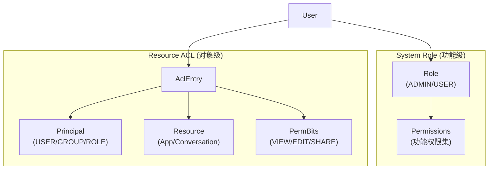

#### 4.3.2 权限计算流程

```typescript
async function checkPermission(
  userId: string,
  resourceType: string,
  resourceId: string,
  action: 'view' | 'edit' | 'share' | 'delete'
): Promise<boolean> {
  // 1. 检查显式拒绝
  const denied = await aclRepo.findDeny(userId, resourceType, resourceId);
  if (denied) return false;

  // 2. 检查用户直授
  const userGrant = await aclRepo.findUserGrant(userId, resourceType, resourceId);
  if (userGrant && hasPermBit(userGrant.permBits, action)) return true;

  // 3. 检查群组授权
  const groups = await groupRepo.findUserGroups(userId);
  for (const group of groups) {
    const groupGrant = await aclRepo.findGroupGrant(group.id, resourceType, resourceId);
    if (groupGrant && hasPermBit(groupGrant.permBits, action)) return true;
  }

  // 4. 默认拒绝
  return false;
}
```

---

## 5. 异步处理与任务队列

### 5.1 BullMQ 队列架构

> 借鉴 Dify 的租户隔离队列 + Document Indexing Pipeline

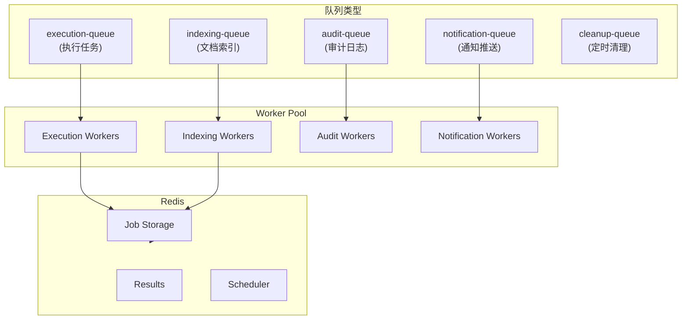

### 5.2 租户隔离的任务队列

借鉴 Dify 的 TenantIsolatedTaskQueue：

```typescript
// BullMQ Group 配置实现租户隔离
const executionQueue = new Queue('execution', {
  connection: redis,
  defaultJobOptions: {
    attempts: 3,
    backoff: {
      type: 'exponential',
      delay: 1000,
    },
  },
});

// 添加任务时携带租户信息
await executionQueue.add(
  'workflow-run',
  { workflowId, inputs },
  {
    group: { id: tenantId }, // 租户级隔离
    priority: 1,
  }
);

// Worker 配置并发限制
const worker = new Worker('execution', processor, {
  connection: redis,
  concurrency: 10,
  group: {
    concurrency: 2, // 每个租户最多 2 个并发任务
  },
});
```

---

## 6. 可观测性设计

### 6.1 OpenTelemetry 集成

> 借鉴 Dify 的 ObservabilityLayer

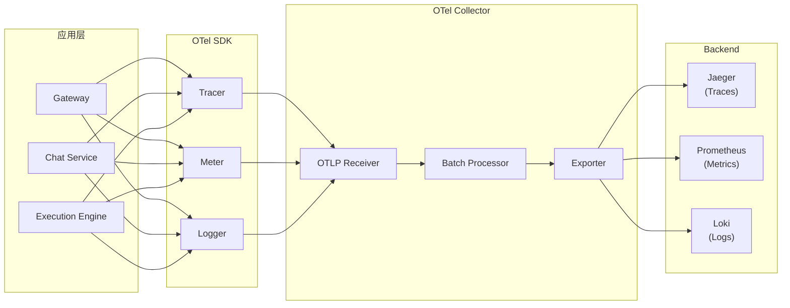

### 6.2 Trace 链路设计

```typescript
// Trace 生成与传播
class TracingLayer implements GatewayLayer {
  name = 'tracing';
  priority = 0;

  async onRequest(ctx: RequestContext): Promise<void> {
    const parentTrace = ctx.request.headers['traceparent'];

    const span = tracer.startSpan('gateway.request', {
      kind: SpanKind.SERVER,
      attributes: {
        'http.method': ctx.request.method,
        'http.url': ctx.request.url,
        'tenant.id': ctx.tenantId,
        'user.id': ctx.userId,
      },
    });

    // 注入 Trace ID 到响应头
    ctx.response.headers['x-trace-id'] = span.spanContext().traceId;

    // 存储到上下文供下游使用
    ctx.trace = {
      traceId: span.spanContext().traceId,
      spanId: span.spanContext().spanId,
      span,
    };
  }
}
```

### 6.3 关键指标定义

| 指标名称 | 类型 | 描述 | 标签 |
|---------|------|------|------|
| `agentifui.request.duration` | Histogram | 请求处理时延 | tenant_id, endpoint, status |
| `agentifui.request.total` | Counter | 请求总数 | tenant_id, endpoint, status |
| `agentifui.token.usage` | Counter | Token 使用量 | tenant_id, user_id, model |
| `agentifui.execution.duration` | Histogram | 执行耗时 | tenant_id, run_type, status |
| `agentifui.queue.depth` | Gauge | 队列深度 | queue_name, tenant_id |

---

## 7. 安全架构

### 7.1 认证与授权

#### 7.1.1 认证方式支持

| 认证方式 | 实现方案 | 优先级 |
|---------|---------|-------|
| 邮箱 + 密码 | bcrypt 哈希 + 双 Token | P0 |
| 手机号 | 第三方短信服务 | P0 |
| Google/GitHub/WeChat | OAuth 2.0 | P0 |
| OIDC/SAML/CAS | @fastify/passport 适配 | P0 |
| MFA (TOTP) | speakeasy 库 | P1 |

#### 7.1.2 凭证安全存储

借鉴 Dify 的加密存储方案：

```typescript
// 敏感凭证加密存储
class CredentialVault {
  private kmsClient: KMSClient;
  private encryptionKey: Buffer;

  async encrypt(plaintext: string): Promise<string> {
    const iv = crypto.randomBytes(16);
    const cipher = crypto.createCipheriv('aes-256-gcm', this.encryptionKey, iv);
    const encrypted = Buffer.concat([cipher.update(plaintext), cipher.final()]);
    const authTag = cipher.getAuthTag();

    return Buffer.concat([iv, authTag, encrypted]).toString('base64');
  }

  async decrypt(ciphertext: string): Promise<string> {
    const data = Buffer.from(ciphertext, 'base64');
    const iv = data.subarray(0, 16);
    const authTag = data.subarray(16, 32);
    const encrypted = data.subarray(32);

    const decipher = crypto.createDecipheriv('aes-256-gcm', this.encryptionKey, iv);
    decipher.setAuthTag(authTag);

    return Buffer.concat([
      decipher.update(encrypted),
      decipher.final(),
    ]).toString();
  }
}
```

### 7.2 内容安全

#### 7.2.1 合规检测流程

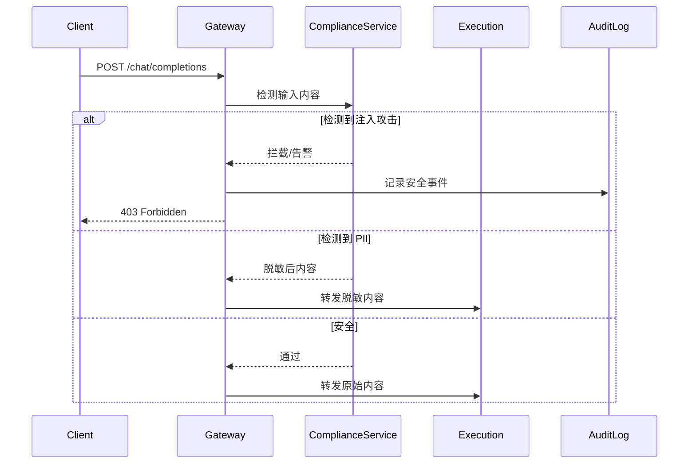

### 7.3 审计系统

> 借鉴 LibreChat 的审计日志模型

```typescript
interface AuditLog {
  id: string;
  timestamp: Date;
  tenantId: string;

  // 操作者信息
  actorId: string;
  actorName: string;
  actorIp: string;
  userAgent: string;

  // 事件信息
  eventType: AuditEventType;
  action: 'create' | 'update' | 'delete' | 'view' | 'export';
  objectType: string;
  objectId: string;

  // 变更快照
  changes?: {
    before: Record<string, unknown>;
    after: Record<string, unknown>;
  };

  // 结果与追溯
  result: 'success' | 'failure';
  reason?: string;
  traceId: string;

  // 安全级别
  severity: 'info' | 'warning' | 'critical';
}
```

---

## 8. 高可用与扩展性

### 8.1 无状态设计

- 所有应用服务设计为无状态，支持多副本部署
- 会话状态存储在 Redis，支持跨实例共享
- 文件存储使用 S3/OSS，与应用实例解耦

### 8.2 水平扩展策略

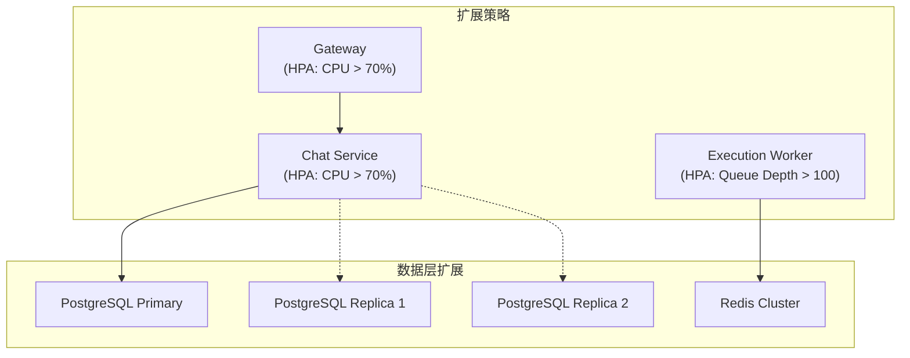

### 8.3 降级策略

| 故障场景 | 降级措施 | 保持可用 |
|---------|---------|---------|
| 编排平台不可用 | 保持只读能力 | 登录、历史、统计、审计 |
| Redis 不可用 | 降级为本地缓存 | 核心功能，性能下降 |
| 向量数据库不可用 | 跳过 RAG 增强 | 对话功能，无引用 |
| 审计服务不可用 | 本地缓冲异步重试 | 全部功能 |

---

## 9. 技术选型决策

### 9.1 借鉴清单总结

| 能力 | 来源 | 决策 | AgentifUI 实现 |
|------|------|------|---------------|
| Layer 插件系统 | Dify | Adopt | Fastify Plugin |
| 双 Token 认证 | LibreChat | Adopt | @fastify/jwt |
| SSE 流式协议 | LobeChat | Adopt | fastify-sse-v2 |
| 虚拟列表 | LobeChat | Adopt | virtua |
| 租户隔离 Repository | Dify | Adopt | AsyncLocalStorage |
| 两层权限模型 | LibreChat | Adopt | CASL + DB ACL |
| Token 用量追踪 | LibreChat | Adopt | BullMQ 异步聚合 |
| Zustand Slice 模式 | LobeChat | Adopt | 前端状态管理 |
| GraphEngine 执行模型 | Dify | Adapt | BullMQ + 状态机 |
| Operation 系统 | LobeChat | Adopt | 前端 + 后端 Job |
| PGlite 客户端数据库 | LobeChat | **Reject** | PostgreSQL 服务端 |
| MeiliSearch 全文搜索 | LibreChat | **Reject** | PostgreSQL FTS |

### 9.2 技术栈汇总

| 层级 | 技术 | 版本 | 备注 |
|------|------|------|------|
| **Frontend** | Next.js | 15.x | App Router |
| | React | 19.x | |
| | TypeScript | 5.x | |
| | Zustand | 5.x | 状态管理 |
| | Radix UI | latest | 无头组件 |
| | TailwindCSS | 4.x | 样式 |
| | virtua | latest | 虚拟列表 |
| **Backend** | Fastify | 5.x | API 框架 |
| | TypeScript | 5.x | |
| | Drizzle ORM | latest | 数据库 ORM |
| | BullMQ | 5.x | 任务队列 |
| | @fastify/jwt | latest | JWT 认证 |
| **Database** | PostgreSQL | 16.x | 主数据库 |
| | Redis | 7.x | 缓存/队列 |
| | S3/MinIO | - | 文件存储 |
| **Observability** | OpenTelemetry | latest | 追踪/指标 |
| | Jaeger/Tempo | latest | Trace 后端 |
| | Prometheus | latest | 指标后端 |
| | Grafana | latest | 可视化 |

---

## 10. 附录

### 附录 A. 关键链路性能指标

| 链路 | 指标 | 目标值 |
|------|------|-------|
| 登录 | 响应时间 | P95 ≤ 500ms |
| 权限判定 | 响应时间 | P95 ≤ 50ms |
| 配额检查 | 响应时间 | P95 ≤ 50ms |
| 对话首 Token | TTFT | P95 ≤ 1.5s |
| 页面加载 | LCP | P95 ≤ 2s |
| API 请求 | 响应时间 | P95 ≤ 300ms |

### 附录 B. 系统容量规划

| 维度 | 规格 |
|------|------|
| 单 Tenant 用户数 | ≥ 50,000 |
| 同时在线用户 | ≥ 1,000 |
| 活跃交互并发 | ≥ 300 |
| 流式连接并发 | ≥ 500 |
| 月度可用性 | ≥ 99.9% |

### 附录 C. 版本历史

| 版本 | 日期 | 变更内容 |
|------|------|---------|
| v1.0 | 2026-01-23 | 初始版本，基于 Dify/LibreChat/LobeChat 分析 |

---

*文档结束*
