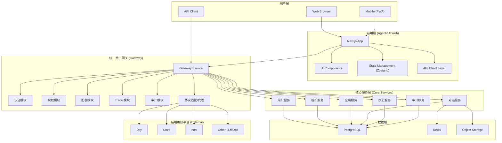
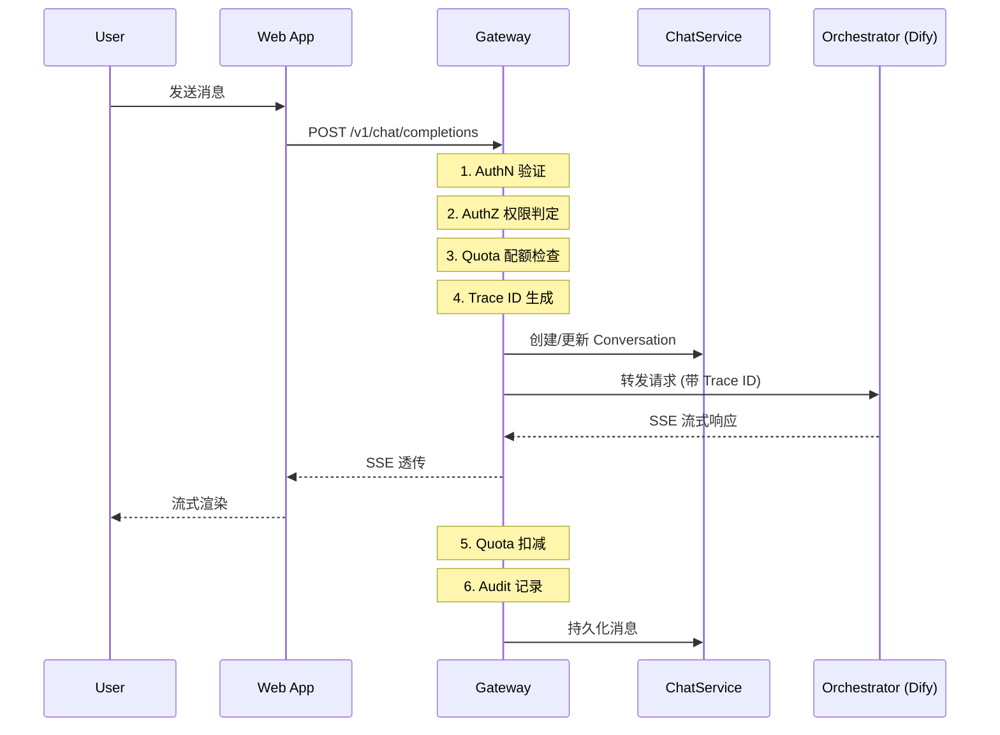
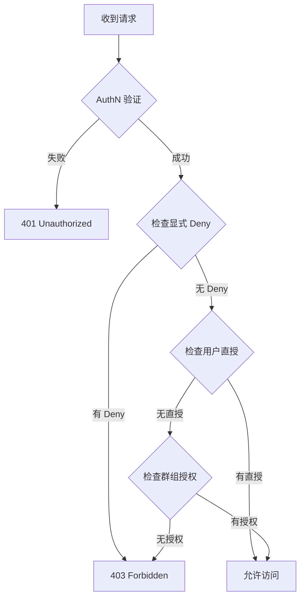

# AgentifUI 系统边界与职责图

* **规范版本**：v0.1
* **最后更新**：2026-01-26
* **状态**：草稿，待评审
* **来源**：基于 PRD 第 5 章 + Dify 架构分析

---

## 1. 概述

本文档定义 AgentifUI 系统的分层架构、各层职责边界与数据流向，作为 Phase 1 开发的架构基线。

### 设计原则

1. **统一入口**：所有 AI 交互通过统一接口网关，屏蔽后端差异
2. **关注点分离**：前端关注交互，网关关注治理，后端关注编排
3. **可观测性优先**：Trace ID 贯穿全链路，支持端到端追踪
4. **多租户原生**：`tenant_id` 贯穿所有层，数据隔离由底层保证

---

## 2. 系统分层架构



---

## 3. 层级职责定义

### 3.1 前端层 (AgentifUI Web)

**技术栈**：Next.js 15 (App Router) + React 19 + TypeScript + Zustand + shadcn/ui + Tailwind CSS

**职责范围**：

| 职责 | 描述 | 不做 |
|------|------|------|
| 交互渲染 | UI 组件、状态展示、响应式布局 | - |
| 基础校验 | 输入格式、长度、必填项 | 业务规则校验 |
| 状态管理 | 本地状态、乐观更新、缓存 | 权限判定 |
| 用户反馈 | Loading、Error、Empty 状态 | 安全拦截 |
| 流式渲染 | SSE 消息流解析与渲染 | 流式生成 |
| 本地持久化 | 会话草稿、用户偏好 | 业务数据存储 |

**API 调用规范**：

- 所有业务请求通过统一 API Client
- 自动注入 `Authorization` / `X-Active-Group-ID` / `X-Trace-ID`
- 统一错误拦截与展示

### 3.2 统一接口网关 (Gateway)

> [!NOTE]
> Gateway 作为独立项目开发，详细架构设计见 [Gateway 项目文档](../../../gateway/README.md)。

**技术栈**：Node.js + Fastify 5.x + 官方插件（cors/rate-limit/jwt/helmet）+ OpenTelemetry

**核心职责**：

| 模块 | 职责 | 输入 | 输出 |
|------|------|------|------|
| **认证 (AuthN)** | 验证用户身份 | Token/Session | 用户身份信息 |
| **授权 (AuthZ)** | 权限判定 | 用户 + 资源 + 操作 | Allow/Deny |
| **配额 (Quota)** | 配额检查与扣减 | 用户 + Group + 资源 | 允许/拒绝 + 余量 |
| **Trace** | 全链路追踪 | 请求入口 | Trace ID (W3C/OTEL) |
| **审计 (Audit)** | 安全事件记录 | 操作上下文 | 审计日志 |
| **协议适配** | OpenAI 兼容协议转换 | 标准请求 | 后端特定格式 |
| **降级** | 后端不可用时的降级处理 | 后端状态 | 降级响应 |

**OpenAI 兼容 API**（v1.0 最小集）：

```
POST /v1/chat/completions      # 对话（含流式）
POST /v1/chat/completions/stop # 停止生成
GET  /v1/models                # 可用模型/应用列表
```

📖 **详细文档**：
- [Gateway 架构设计](../../../gateway/ARCHITECTURE.md)
- [Gateway 仓库结构](../../../gateway/REPO_STRUCTURE.md)
- [Gateway Phase 1 MVP](../../../gateway/PHASE1_MVP.md)
- [Gateway ↔ Core API 内部协议](../../../gateway/api/INTERNAL_API.md)

### 3.3 核心服务层 (Core Services)

**架构模式**：参考 Dify 的 Controller → Service → Repository 分层

```
controllers/          # HTTP 请求处理，参数校验，响应序列化
├── console/         # 管理后台 API
├── api/             # 开放 API（第三方集成）
└── web/             # 用户前端 API

services/            # 业务逻辑，事务协调
├── user_service.py
├── org_service.py
├── app_service.py
├── chat_service.py
├── run_service.py
└── audit_service.py

repositories/        # 数据访问抽象
models/              # ORM 模型定义
core/                # 领域核心逻辑
```

**服务职责**：

| 服务 | 职责 | 关键实体 |
|------|------|----------|
| UserService | 用户生命周期、认证集成 | Account |
| OrgService | 租户/群组管理、成员关系 | Tenant, Group, TenantAccountJoin |
| AppService | 应用注册、配置、授权 | App, AppGrant |
| ChatService | 对话管理、消息持久化 | Conversation, Message |
| RunService | 执行追踪、状态管理 | Run, RunStep |
| AuditService | 审计日志写入与查询 | AuditEvent |

### 3.4 数据层

| 组件 | 用途 | 关键数据 |
|------|------|----------|
| **PostgreSQL** | 关系数据存储 | 用户、组织、应用、对话、审计 |
| **Redis** | 缓存与会话 | 登录态、权限缓存、配额计数、限流 |
| **Object Storage** | 文件存储 | 上传文件、Artifacts、导出文件 |

### 3.5 后端编排平台 (External)

**集成方式**：通过统一接口网关的协议适配层访问

**支持平台**（v1.0）：

- Dify（主要）
- Coze
- n8n
- 任何 OpenAI 兼容 API

**职责边界**：

- ✅ AgentifUI 负责：身份、授权、配额、审计、Trace、会话管理
- ❌ AgentifUI 不负责：编排逻辑、模型调用、工具执行

---

## 4. 职责分工矩阵

| 能力 | 前端 | 网关 | 核心服务 | 后端编排 |
|------|------|------|----------|----------|
| **用户身份鉴权** | 发起请求 | **执行验证** | 用户服务 | - |
| **Trace ID 生成** | 携带展示 | **生成贯穿** | 传递 | 接收 |
| **权限判定** | 展示结果 | **执行判定** | 权限服务 | - |
| **配额检查/扣减** | - | **执行** | 配额服务 | - |
| **内容合规检测** | 提示 | **执行检测** | - | - |
| **流式响应** | **渲染** | 透传 | - | 生成 |
| **停止生成** | 发起信号 | **转发/软停止** | - | 执行终止 |
| **审计记录** | - | **记录** | 审计服务 | - |
| **对话持久化** | - | - | **ChatService** | - |
| **执行追踪** | 展示 | Trace 注入 | **RunService** | 提供状态 |

---

## 5. 数据流图

### 5.1 用户对话流程



### 5.2 权限判定流程



---

## 6. 多租户隔离

### 6.1 隔离策略

**数据隔离**：所有业务表必须包含 `tenant_id` 列，查询必须携带租户上下文

**隔离范围**（参考 Dify `Tenant` 模型）：

- 用户数据（Account 通过 TenantAccountJoin 关联）
- 群组数据（Group）
- 对话与消息（Conversation, Message）
- 执行记录（Run）
- 审计日志（AuditEvent）
- 应用授权（AppGrant）
- 配额与统计

### 6.2 租户上下文传递

```
# HTTP Header
X-Tenant-ID: {tenant_id}

# 从 Token 解析
jwt.claims.tenant_id

# 数据库查询约束
WHERE tenant_id = :tenant_id
```

---

## 7. 降级策略

| 场景 | 降级行为 | 用户体验 |
|------|----------|----------|
| **编排平台不可用** | 保持登录/导航/历史/统计/审计可用 | 生成入口显示不可用提示 |
| **不支持 stop** | 软停止（停止渲染） | 提示"后端可能仍在执行" |
| **不支持引用** | 隐藏引用区域 | 显示不可用提示 |
| **不支持工具调用** | 降级为文本提示 | 显示结构化交互不可用说明 |

---

## 8. 可观测性接口

### 8.1 Trace 规范

**格式**：W3C Trace Context / OpenTelemetry

**Trace ID 生命周期**：

1. 网关生成 Trace ID
2. 注入到所有下游请求
3. 持久化到 Run 记录
4. 前端展示并支持复制

### 8.2 外部观测平台集成

**配置层级**：

- 全局默认配置
- Tenant 级覆盖

**跳转 URL 模板**：

```
https://trace.example.com/trace/{trace_id}
```

---

## 9. 与 Dify 架构的对应关系

| AgentifUI 组件 | Dify 对应 | 差异说明 |
|----------------|-----------|----------|
| 前端层 | `web/` (Next.js) | 相似，专注交互 |
| 统一接口网关 | 无直接对应 | Dify 无独立网关层，AgentifUI 新增 |
| 核心服务层 | `api/services/` | 参考 Controller→Service 分层 |
| 数据模型 | `api/models/` | 参考 Tenant/Account/App 设计 |
| 审计 | 部分覆盖 | AgentifUI 需增强审计能力 |

---

## 10. 技术选型决策（已确认）

> [!NOTE]
> 以下技术选型已于 2026-01-26 确认：

| 领域 | 选型 | 说明 |
|------|------|------|
| **前端框架** | Next.js 15 (App Router) + React 19 | 与 LobeChat 对齐 |
| **UI 组件库** | shadcn/ui + Tailwind CSS | 可定制性强、体积小 |
| **状态管理** | Zustand | 轻量、TypeScript 友好 |
| **后端网关** | Fastify 5.x + 官方插件 | 高性能、轻量（~3MB）、保留升级路径 |
| **数据库 ORM** | Drizzle ORM + PostgreSQL | 类型安全、性能优 |
| **认证系统** | better-auth + RBAC | 开源、灵活 |
| **缓存** | Redis | 会话、配额、限流 |
| **异步队列** | BullMQ | Redis-based、Node.js 原生 |
| **可观测性** | OpenTelemetry + Pino | Fastify 原生支持 |

---

## 附录 A：参考资料

- [Dify 源码](https://github.com/langgenius/dify) - 架构分析来源
- [PRD 第 5 章](../prd/PRD.md#5-系统架构与职责边界) - 需求来源
- [LobeChat](https://github.com/lobehub/lobe-chat) - Next.js + Zustand 前端参考
- [Fastify](https://github.com/fastify/fastify) - 高性能 Node.js Web 框架
