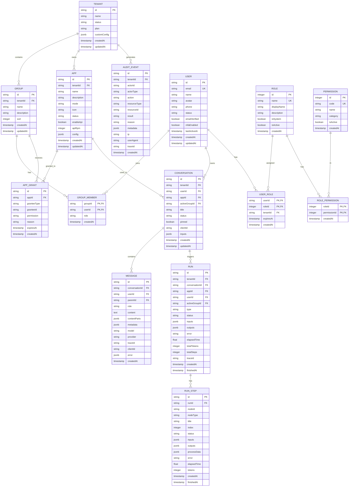

# AgentifUI 核心领域模型 v0

* **规范版本**：v0.2
* **最后更新**：2026-01-26
* **状态**：草稿，待评审
* **参考**：Dify `api/models/` + LobeChat `packages/database/src/schemas/` + LibreChat `api/models/`

---

## 1. 概述

本文档定义 AgentifUI 的核心领域模型，作为数据库设计的基线。模型设计遵循以下原则：

1. **多租户原生**：所有业务实体包含 `tenantId`，支持租户级数据隔离
2. **类型安全**：使用 Drizzle ORM，所有字段有明确类型定义
3. **关系明确**：实体间关系通过外键约束保证完整性
4. **审计友好**：关键实体包含 `createdAt` / `updatedAt` / `createdBy`
5. **离线友好**：支持 `clientId` 用于乐观更新和离线同步（参考 LobeChat）

---

## 2. 实体关系图 (ERD)



---

## 3. 核心实体定义

### 3.1 租户与组织

#### Tenant（租户）

最高级数据隔离与治理单元。

| 字段 | 类型 | 约束 | 说明 |
|------|------|------|------|
| id | uuid | PK | 主键 |
| name | varchar(255) | NOT NULL | 租户名称 |
| status | varchar(32) | NOT NULL, DEFAULT 'normal' | normal / archived |
| plan | varchar(32) | DEFAULT 'basic' | 订阅计划 |
| customConfig | jsonb | | 自定义配置 |
| createdAt | timestamp | NOT NULL | 创建时间 |
| updatedAt | timestamp | NOT NULL | 更新时间 |

**参考**：Dify `Tenant` + LobeChat 无对应（单租户架构）

---

#### Group（群组）

租户内的组织单元，用于成员组织和应用授权。

| 字段 | 类型 | 约束 | 说明 |
|------|------|------|------|
| id | uuid | PK | 主键 |
| tenantId | uuid | FK → Tenant, NOT NULL | 所属租户 |
| name | varchar(255) | NOT NULL | 群组名称 |
| description | text | | 描述 |
| sort | integer | | 排序 |
| createdAt | timestamp | NOT NULL | 创建时间 |
| updatedAt | timestamp | NOT NULL | 更新时间 |

**索引**：`(tenantId)`

---

#### GroupMember（群组成员）

用户与群组的多对多关系，包含角色信息。

| 字段 | 类型 | 约束 | 说明 |
|------|------|------|------|
| groupId | uuid | PK, FK → Group | 群组 ID |
| userId | uuid | PK, FK → User | 用户 ID |
| role | varchar(32) | DEFAULT 'member' | member / manager |
| createdAt | timestamp | NOT NULL | 加入时间 |

**参考**：Dify `TenantAccountJoin`

---

### 3.2 用户与认证

#### User（用户）

用户账户实体，集成 better-auth。

| 字段 | 类型 | 约束 | 说明 |
|------|------|------|------|
| id | uuid | PK | 主键 |
| email | varchar(255) | UNIQUE | 邮箱 |
| name | varchar(255) | NOT NULL | 显示名称 |
| avatar | text | | 头像 URL |
| phone | varchar(32) | UNIQUE | 手机号 |
| status | varchar(32) | NOT NULL, DEFAULT 'active' | active / pending / banned |
| emailVerified | boolean | DEFAULT false | 邮箱已验证 |
| mfaEnabled | boolean | DEFAULT false | MFA 已启用 |
| preference | jsonb | | 用户偏好设置 |
| lastActiveAt | timestamp | NOT NULL | 最后活跃时间 |
| createdAt | timestamp | NOT NULL | 创建时间 |
| updatedAt | timestamp | NOT NULL | 更新时间 |

**参考**：Dify `Account` + LobeChat `users`

> [!NOTE]
> better-auth 会自动创建 `accounts`、`sessions`、`verifications` 等认证相关表，此处 `User` 为业务用户表。

---

### 3.3 RBAC 权限

#### Role（角色）

角色定义表。

| 字段 | 类型 | 约束 | 说明 |
|------|------|------|------|
| id | serial | PK | 主键 |
| name | varchar(64) | UNIQUE, NOT NULL | 角色标识 |
| displayName | varchar(255) | NOT NULL | 显示名称 |
| description | text | | 描述 |
| isSystem | boolean | DEFAULT false | 系统角色不可删除 |
| isActive | boolean | DEFAULT true | 是否启用 |
| createdAt | timestamp | NOT NULL | 创建时间 |

**预置角色**：
- `root_admin` - 平台超级管理员（默认关闭）
- `tenant_admin` - 租户管理员
- `user` - 普通用户

**参考**：LobeChat `rbac.ts` + Dify `TenantAccountRole`

---

#### Permission（权限）

权限定义表。

| 字段 | 类型 | 约束 | 说明 |
|------|------|------|------|
| id | serial | PK | 主键 |
| code | varchar(64) | UNIQUE, NOT NULL | 权限代码 |
| name | varchar(255) | NOT NULL | 权限名称 |
| category | varchar(64) | NOT NULL | 分类 |
| isActive | boolean | DEFAULT true | 是否启用 |
| createdAt | timestamp | NOT NULL | 创建时间 |

**权限代码格式**（参考 LibreChat）：

```
{category}:{action}
```

**预置权限示例**：

| code | name | category |
|------|------|----------|
| `tenant:manage` | 管理租户设置 | tenant |
| `tenant:view_audit` | 查看审计日志 | tenant |
| `group:create` | 创建群组 | group |
| `group:manage` | 管理群组成员 | group |
| `app:register` | 注册应用 | app |
| `app:grant` | 授权应用访问 | app |
| `conversation:view_others` | 查看他人对话 | conversation |
| `conversation:export` | 导出对话 | conversation |

**权限分类**：
- `tenant` - 租户管理
- `group` - 群组管理
- `app` - 应用管理
- `conversation` - 对话管理
- `audit` - 审计查看

---

#### RolePermission（角色-权限关联）

| 字段 | 类型 | 约束 | 说明 |
|------|------|------|------|
| roleId | integer | PK, FK → Role | 角色 ID |
| permissionId | integer | PK, FK → Permission | 权限 ID |
| createdAt | timestamp | NOT NULL | 创建时间 |

---

#### UserRole（用户-角色关联）

| 字段 | 类型 | 约束 | 说明 |
|------|------|------|------|
| userId | uuid | PK, FK → User | 用户 ID |
| roleId | integer | PK, FK → Role | 角色 ID |
| tenantId | uuid | FK → Tenant | 角色生效的租户范围 |
| expiresAt | timestamp | | 过期时间（临时角色） |
| createdAt | timestamp | NOT NULL | 创建时间 |

---

### 3.4 应用与授权

#### App（应用）

注册的 AI 应用。

| 字段 | 类型 | 约束 | 说明 |
|------|------|------|------|
| id | uuid | PK | 主键 |
| tenantId | uuid | FK → Tenant, NOT NULL | 所属租户 |
| externalId | varchar(255) | | 外部平台 ID |
| externalPlatform | varchar(64) | | dify / coze / n8n / openai |
| name | varchar(255) | NOT NULL | 应用名称 |
| description | text | | 描述 |
| mode | varchar(64) | NOT NULL | chat / workflow / agent / completion |
| icon | text | | 图标 URL |
| iconType | varchar(32) | | image / emoji / link |
| status | varchar(32) | DEFAULT 'active' | active / disabled / deleted |
| enableApi | boolean | DEFAULT true | 是否启用 API |
| apiRpm | integer | DEFAULT 0 | API 速率限制 |
| config | jsonb | | 应用配置 |
| createdBy | uuid | FK → User | 创建者 |
| createdAt | timestamp | NOT NULL | 创建时间 |
| updatedAt | timestamp | NOT NULL | 更新时间 |

**索引**：`(tenantId)`, `(tenantId, status)`

**参考**：Dify `App`

---

#### AppGrant（应用授权）

应用访问授权记录。

| 字段 | 类型 | 约束 | 说明 |
|------|------|------|------|
| id | uuid | PK | 主键 |
| appId | uuid | FK → App, NOT NULL | 应用 ID |
| granteeType | varchar(32) | NOT NULL | group / user |
| granteeId | uuid | NOT NULL | 群组 ID 或用户 ID |
| permission | varchar(32) | DEFAULT 'use' | use / deny |
| reason | text | | 授权原因（用户直授必填） |
| grantedBy | uuid | FK → User | 授权人 |
| expiresAt | timestamp | | 过期时间 |
| createdAt | timestamp | NOT NULL | 创建时间 |

**索引**：`(appId)`, `(granteeType, granteeId)`

---

### 3.5 对话与消息

#### Conversation（会话）

用户与应用的对话会话。

| 字段 | 类型 | 约束 | 说明 |
|------|------|------|------|
| id | uuid | PK | 主键 |
| tenantId | uuid | FK → Tenant, NOT NULL | 所属租户 |
| userId | uuid | FK → User, NOT NULL | 所属用户 |
| appId | uuid | FK → App, NOT NULL | 关联应用 |
| activeGroupId | uuid | FK → Group | 当前活跃群组（配额归因） |
| externalId | varchar(255) | | 外部平台会话 ID |
| title | varchar(512) | | 会话标题 |
| status | varchar(32) | DEFAULT 'active' | active / archived / deleted |
| pinned | boolean | DEFAULT false | 是否置顶 |
| clientId | text | UNIQUE | 客户端生成 ID（乐观更新） |
| inputs | jsonb | | 会话输入参数 |
| createdAt | timestamp | NOT NULL | 创建时间 |
| updatedAt | timestamp | NOT NULL | 更新时间 |

**索引**：`(tenantId, userId)`, `(appId)`, `(userId, updatedAt)`

**参考**：Dify `Conversation` + LobeChat `sessions`

---

#### Message（消息）

会话中的单条消息。

| 字段 | 类型 | 约束 | 说明 |
|------|------|------|------|
| id | uuid | PK | 主键 |
| conversationId | uuid | FK → Conversation, NOT NULL | 所属会话 |
| userId | uuid | FK → User, NOT NULL | 用户 ID |
| parentId | uuid | FK → Message | 父消息（编辑重发/线程） |
| role | varchar(32) | NOT NULL | user / assistant / system / tool |
| content | text | | 消息内容（纯文本兼容） |
| contentParts | jsonb | | 多部分内容（见下方结构） |
| metadata | jsonb | | 元数据（reasoning、search 等） |
| model | varchar(255) | | 使用的模型 |
| provider | varchar(64) | | 模型提供商 |
| traceId | varchar(64) | | 追踪 ID |
| observationId | varchar(64) | | 观测 ID |
| clientId | text | UNIQUE | 客户端生成 ID（乐观更新） |
| error | jsonb | | 错误信息 |
| createdAt | timestamp | NOT NULL | 创建时间 |

**contentParts 结构**（参考 LibreChat）：

```typescript
type ContentPart = 
  | { type: 'text'; text: string }
  | { type: 'think'; think: string }         // 推理内容
  | { type: 'image'; imageUrl: string }
  | { type: 'artifact'; artifact: Artifact }  // 代码/文档产物
  | { type: 'citation'; citation: Citation }; // 引用来源

interface MessageContent {
  parts: ContentPart[];
}
```

**索引**：`(conversationId, createdAt)`, `(userId)`, `(traceId)`, `(clientId)`

**参考**：Dify `Message` + LobeChat `messages` + LibreChat `Message.content[]`

---

### 3.6 执行追踪

#### Run（执行记录）

工作流/Agent/生成任务的执行实例。

| 字段 | 类型 | 约束 | 说明 |
|------|------|------|------|
| id | uuid | PK | 主键 |
| tenantId | uuid | FK → Tenant, NOT NULL | 所属租户 |
| conversationId | uuid | FK → Conversation | 关联会话 |
| appId | uuid | FK → App, NOT NULL | 关联应用 |
| userId | uuid | FK → User, NOT NULL | 触发用户 |
| activeGroupId | uuid | FK → Group | 配额归因群组 |
| type | varchar(32) | NOT NULL | workflow / agent / generation |
| triggeredFrom | varchar(32) | | app-run / debugging / api |
| status | varchar(32) | NOT NULL | pending / running / succeeded / failed / stopped |
| inputs | jsonb | | 输入参数 |
| outputs | jsonb | | 输出结果 |
| error | text | | 错误信息 |
| elapsedTime | float | DEFAULT 0 | 执行耗时（秒） |
| totalTokens | bigint | DEFAULT 0 | 总 Token 数 |
| totalSteps | integer | DEFAULT 0 | 总步骤数 |
| traceId | varchar(64) | NOT NULL | 追踪 ID |
| createdAt | timestamp | NOT NULL | 开始时间 |
| finishedAt | timestamp | | 结束时间 |

**索引**：`(tenantId, appId)`, `(conversationId)`, `(traceId)`, `(userId, createdAt)`

**参考**：Dify `WorkflowRun`

---

#### RunStep（执行步骤）

单个节点/步骤的执行记录。

| 字段 | 类型 | 约束 | 说明 |
|------|------|------|------|
| id | uuid | PK | 主键 |
| runId | uuid | FK → Run, NOT NULL | 所属执行 |
| nodeId | varchar(255) | NOT NULL | 节点 ID |
| nodeType | varchar(64) | NOT NULL | 节点类型 |
| title | varchar(255) | | 节点标题 |
| index | integer | NOT NULL | 执行顺序 |
| status | varchar(32) | NOT NULL | running / succeeded / failed |
| inputs | jsonb | | 输入 |
| outputs | jsonb | | 输出 |
| processData | jsonb | | 处理过程数据 |
| error | text | | 错误信息 |
| elapsedTime | float | DEFAULT 0 | 耗时（秒） |
| tokens | integer | DEFAULT 0 | Token 数 |
| createdAt | timestamp | NOT NULL | 开始时间 |
| finishedAt | timestamp | | 结束时间 |

**索引**：`(runId, index)`

**参考**：Dify `WorkflowNodeExecutionModel`

---

### 3.7 审计日志

#### AuditEvent（审计事件）

不可篡改的审计日志记录。

| 字段 | 类型 | 约束 | 说明 |
|------|------|------|------|
| id | uuid | PK | 主键 |
| tenantId | uuid | FK → Tenant, NOT NULL | 所属租户 |
| actorId | uuid | NOT NULL | 操作者 ID |
| actorType | varchar(32) | NOT NULL | user / system / api |
| action | varchar(64) | NOT NULL | 动作代码 |
| resourceType | varchar(64) | NOT NULL | 资源类型 |
| resourceId | varchar(255) | | 资源 ID |
| result | varchar(32) | NOT NULL | success / failure / denied |
| reason | text | | 操作原因 |
| metadata | jsonb | | 附加数据 |
| ip | varchar(64) | | 来源 IP |
| userAgent | text | | User Agent |
| traceId | varchar(64) | | 追踪 ID |
| createdAt | timestamp | NOT NULL | 发生时间 |

**索引**：`(tenantId, createdAt)`, `(actorId)`, `(action)`, `(resourceType, resourceId)`

**审计事件类别**（见 `AUDIT_EVENTS_P1.md`）

---

## 4. Drizzle Schema 示例

以下是 Tenant 和 Group 的 Drizzle ORM schema 示例：

```typescript
// schemas/tenant.ts
import { pgTable, text, varchar, jsonb, timestamp } from 'drizzle-orm/pg-core';

export const tenants = pgTable('tenants', {
  id: text('id').primaryKey().$defaultFn(() => crypto.randomUUID()),
  name: varchar('name', { length: 255 }).notNull(),
  status: varchar('status', { length: 32 }).notNull().default('normal'),
  plan: varchar('plan', { length: 32 }).default('basic'),
  customConfig: jsonb('custom_config'),
  createdAt: timestamp('created_at', { withTimezone: true }).notNull().defaultNow(),
  updatedAt: timestamp('updated_at', { withTimezone: true }).notNull().defaultNow(),
});

export type Tenant = typeof tenants.$inferSelect;
export type NewTenant = typeof tenants.$inferInsert;
```

```typescript
// schemas/group.ts
import { pgTable, text, varchar, integer, timestamp, index } from 'drizzle-orm/pg-core';
import { tenants } from './tenant';

export const groups = pgTable('groups', {
  id: text('id').primaryKey().$defaultFn(() => crypto.randomUUID()),
  tenantId: text('tenant_id').notNull().references(() => tenants.id, { onDelete: 'cascade' }),
  name: varchar('name', { length: 255 }).notNull(),
  description: text('description'),
  sort: integer('sort'),
  createdAt: timestamp('created_at', { withTimezone: true }).notNull().defaultNow(),
  updatedAt: timestamp('updated_at', { withTimezone: true }).notNull().defaultNow(),
}, (table) => [
  index('groups_tenant_id_idx').on(table.tenantId),
]);

export type Group = typeof groups.$inferSelect;
export type NewGroup = typeof groups.$inferInsert;
```

---

## 5. 与参考项目对比

| 实体 | AgentifUI | Dify | LobeChat |
|------|-----------|------|----------|
| 租户 | `Tenant` | `Tenant` | 无（单租户） |
| 用户 | `User` | `Account` | `users` |
| 群组 | `Group` + `GroupMember` | 无（通过 TenantAccountJoin 角色区分） | 无 |
| 角色 | `Role` + `UserRole` | `TenantAccountRole`（枚举） | `rbac_roles` + `rbac_user_roles` |
| 应用 | `App` | `App` | 无（使用 agents） |
| 授权 | `AppGrant` | 无（应用级 `enable_site`/`enable_api`） | 无 |
| 会话 | `Conversation` | `Conversation` | `sessions` |
| 消息 | `Message` | `Message`（继承关系） | `messages` |
| 执行 | `Run` + `RunStep` | `WorkflowRun` + `WorkflowNodeExecution` | 无 |
| 审计 | `AuditEvent` | 部分覆盖 | 无 |

---

## 6. 待确认项

> [!IMPORTANT]
> 以下设计决策需在 FRD 阶段确认：

1. **配额数据模型**：是否需要独立的 `Quota` / `QuotaUsage` 表，还是基于 `Run` 聚合计算？
2. **文件关联**：`Message` 与文件的关联是否需要独立的 `MessageFile` 表？
3. **Artifacts**：是否需要独立的 `Artifact` 表存储代码/文档产物？
4. **通知**：站内通知的数据模型（`Notification` 表）？

---

## 附录 A：相关文档

- [系统边界与职责图](../architecture/SYSTEM_BOUNDARY.md)
- [技术选型](../TECHNOLOGY_STACK.md)
- [网关契约 v0](../api-contracts/GATEWAY_CONTRACT_P1.md)（待创建）
- [审计事件 v0](../security/AUDIT_EVENTS_P1.md)（待创建）
