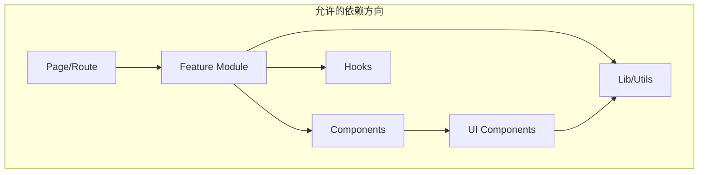
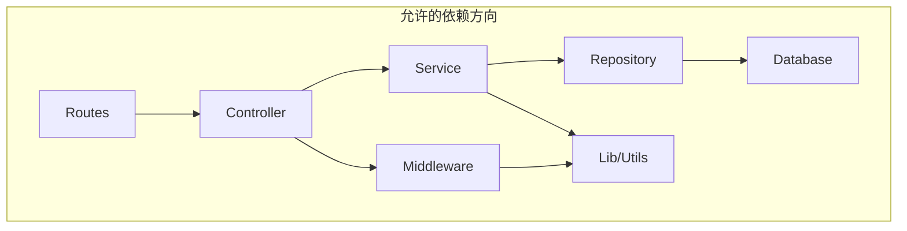

# AgentifUI 代码仓库目录规范

* **文档版本**：v1.0
* **状态**：设计中
* **最后更新**：2026-01-23
* **依赖文档**：[ARCHITECTURE.md](../architecture/ARCHITECTURE.md)、[TECHNOLOGY_STACK.md](../TECHNOLOGY_STACK.md)

---

## 1. 概述

### 1.1 设计目标

| 目标 | 描述 |
|------|------|
| **职责清晰** | 每个目录有明确的职责边界，避免功能交叉 |
| **可扩展性** | 新增模块不影响现有结构，支持团队并行开发 |
| **一致性** | 前后端遵循统一的组织原则，降低认知负担 |
| **可发现性** | 开发者能快速定位代码位置，减少查找时间 |

### 1.2 仓库策略

AgentifUI 采用 **Monorepo** 架构，使用 **pnpm workspace** 管理多个包：

| 包名 | 类型 | 描述 |
|------|------|------|
| `@agentifui/web` | 应用 | Next.js 前端应用 |
| `@agentifui/api` | 应用 | Fastify 后端服务 |
| `@agentifui/worker` | 应用 | BullMQ Worker 服务 |
| `@agentifui/shared` | 库 | 前后端共享类型与工具 |
| `@agentifui/ui` | 库 | UI 组件库 |
| `@agentifui/db` | 库 | 数据库 Schema 与迁移 |

---

## 2. 顶层目录结构

```
agentifui/
├── .github/                    # GitHub 配置
│   ├── workflows/              # CI/CD 工作流
│   │   ├── ci.yml              # PR 检查 (lint, test, type-check)
│   │   ├── deploy-staging.yml  # Staging 部署 (push to main)
│   │   └── deploy-prod.yml     # 生产部署 (tag release)
│   ├── actions/                # Composite Actions
│   │   ├── setup-node/         # Node.js 缓存复用
│   │   └── setup-python/       # Python 缓存复用
│   ├── ISSUE_TEMPLATE/         # Issue 模板
│   └── PULL_REQUEST_TEMPLATE.md
├── .husky/                     # Git Hooks
├── .vscode/                    # VS Code 配置
│   ├── settings.json
│   ├── extensions.json
│   └── launch.json
├── apps/                       # 应用程序
│   ├── web/                    # 前端应用
│   ├── api/                    # 后端服务
│   └── worker/                 # Worker 服务
├── packages/                   # 共享包
│   ├── shared/                 # 共享类型与工具
│   ├── ui/                     # UI 组件库
│   └── db/                     # 数据库包
├── docs/                       # 项目文档
│   ├── architecture/           # 架构文档
│   ├── api/                    # API 文档
│   └── guides/                 # 开发指南
├── scripts/                    # 构建与运维脚本
│   ├── dev.sh                  # 本地开发启动
│   ├── build.sh                # 构建脚本
│   └── deploy.sh               # 部署脚本
├── docker/                     # Docker 配置
│   ├── Dockerfile.web
│   ├── Dockerfile.api
│   ├── Dockerfile.worker
│   └── docker-compose.yml
├── infra/                      # 基础设施配置
│   ├── k8s/                    # Kubernetes 配置
│   ├── terraform/              # Terraform 配置（可选）
│   └── helm/                   # Helm Charts
├── .env.example                # 环境变量模板
├── .eslintrc.js                # ESLint 配置
├── .prettierrc                 # Prettier 配置
├── .gitignore
├── package.json                # 根 package.json
├── pnpm-workspace.yaml         # pnpm workspace 配置
├── turbo.json                  # Turborepo 配置
├── tsconfig.base.json          # 基础 TypeScript 配置
└── README.md
```

### 2.1 目录职责说明

| 目录 | 职责 | 注意事项 |
|------|------|---------|
| `apps/` | 可部署的应用程序 | 每个应用独立构建与部署 |
| `packages/` | 共享库与工具包 | 被 apps 引用，不独立部署 |
| `docs/` | 项目文档 | 架构决策、API 规范、开发指南 |
| `scripts/` | 构建与运维脚本 | 跨平台兼容 |
| `docker/` | 容器化配置 | 开发与生产环境 Dockerfile |
| `infra/` | 基础设施即代码 | K8s、Terraform 等 |

---

## 3. 前端应用结构 (`apps/web`)

```
apps/web/
├── public/                     # 静态资源
│   ├── fonts/
│   ├── images/
│   └── locales/                # 国际化资源
│       ├── en/
│       │   └── common.json
│       └── zh/
│           └── common.json
├── src/
│   ├── app/                    # Next.js App Router
│   │   ├── (auth)/             # 认证相关路由组
│   │   │   ├── login/
│   │   │   │   └── page.tsx
│   │   │   ├── register/
│   │   │   │   └── page.tsx
│   │   │   └── layout.tsx
│   │   ├── (main)/             # 主应用路由组
│   │   │   ├── chat/
│   │   │   │   ├── [conversationId]/
│   │   │   │   │   └── page.tsx
│   │   │   │   └── page.tsx
│   │   │   ├── apps/
│   │   │   │   └── page.tsx
│   │   │   ├── history/
│   │   │   │   └── page.tsx
│   │   │   ├── settings/
│   │   │   │   └── page.tsx
│   │   │   └── layout.tsx
│   │   ├── (admin)/            # 管理后台路由组
│   │   │   ├── users/
│   │   │   ├── groups/
│   │   │   ├── apps/
│   │   │   ├── audit/
│   │   │   └── layout.tsx
│   │   ├── api/                # API Routes (BFF)
│   │   │   └── [...proxy]/
│   │   │       └── route.ts
│   │   ├── layout.tsx          # 根布局
│   │   ├── page.tsx            # 首页
│   │   ├── error.tsx           # 错误边界
│   │   ├── loading.tsx         # 加载状态
│   │   ├── not-found.tsx       # 404 页面
│   │   └── globals.css         # 全局样式
│   ├── components/             # 组件目录
│   │   ├── ui/                 # 基础 UI 组件
│   │   │   ├── button.tsx
│   │   │   ├── input.tsx
│   │   │   ├── dialog.tsx
│   │   │   ├── dropdown-menu.tsx
│   │   │   └── index.ts
│   │   ├── chat/               # 对话相关组件
│   │   │   ├── message-list.tsx
│   │   │   ├── message-item.tsx
│   │   │   ├── chat-input.tsx
│   │   │   ├── conversation-list.tsx
│   │   │   └── index.ts
│   │   ├── layout/             # 布局组件
│   │   │   ├── header.tsx
│   │   │   ├── sidebar.tsx
│   │   │   ├── footer.tsx
│   │   │   └── index.ts
│   │   └── shared/             # 通用业务组件
│   │       ├── app-card.tsx
│   │       ├── user-avatar.tsx
│   │       └── index.ts
│   ├── features/               # 功能模块（Feature Slices）
│   │   ├── auth/               # 认证模块
│   │   │   ├── components/
│   │   │   │   ├── login-form.tsx
│   │   │   │   └── register-form.tsx
│   │   │   ├── hooks/
│   │   │   │   └── use-auth.ts
│   │   │   ├── api/
│   │   │   │   └── auth.ts
│   │   │   └── index.ts
│   │   ├── chat/               # 对话模块
│   │   │   ├── components/
│   │   │   ├── hooks/
│   │   │   ├── api/
│   │   │   ├── store/
│   │   │   │   ├── index.ts
│   │   │   │   └── slices/
│   │   │   │       ├── message.ts
│   │   │   │       ├── conversation.ts
│   │   │   │       └── input.ts
│   │   │   └── index.ts
│   │   ├── apps/               # 应用模块
│   │   │   ├── components/
│   │   │   ├── hooks/
│   │   │   ├── api/
│   │   │   └── index.ts
│   │   └── admin/              # 管理模块
│   │       ├── users/
│   │       ├── groups/
│   │       ├── audit/
│   │       └── index.ts
│   ├── hooks/                  # 通用 Hooks
│   │   ├── use-debounce.ts
│   │   ├── use-local-storage.ts
│   │   ├── use-media-query.ts
│   │   └── index.ts
│   ├── lib/                    # 工具库
│   │   ├── api-client.ts       # API 客户端
│   │   ├── sse/                # SSE 处理
│   │   │   ├── fetch-sse.ts
│   │   │   └── smooth-message.ts
│   │   ├── utils.ts            # 通用工具函数
│   │   └── cn.ts               # className 合并
│   ├── providers/              # Context Providers
│   │   ├── query-provider.tsx
│   │   ├── theme-provider.tsx
│   │   ├── intl-provider.tsx
│   │   └── index.tsx
│   ├── styles/                 # 样式配置
│   │   └── tailwind.css
│   └── types/                  # 类型定义
│       ├── api.ts
│       ├── chat.ts
│       └── index.ts
├── .env.local                  # 本地环境变量
├── next.config.ts              # Next.js 配置
├── tailwind.config.ts          # Tailwind 配置
├── tsconfig.json               # TypeScript 配置
├── package.json
└── README.md
```

### 3.1 前端目录约定

#### 组件分类规则

| 目录 | 内容 | 示例 |
|------|------|------|
| `components/ui/` | 无业务逻辑的基础组件 | Button, Input, Dialog |
| `components/layout/` | 布局类组件 | Header, Sidebar, Footer |
| `components/shared/` | 可复用的业务组件 | AppCard, UserAvatar |
| `features/*/components/` | 功能模块专属组件 | LoginForm, MessageList |

#### Feature 模块结构

每个 Feature 模块应包含：

```
features/{feature-name}/
├── components/           # 功能组件
├── hooks/                # 功能 Hooks
├── api/                  # API 请求函数
├── store/                # Zustand Store（如需要）
│   ├── index.ts
│   └── slices/
├── types/                # 模块类型定义（如需要）
└── index.ts              # 模块导出
```

#### 文件命名规则

| 类型 | 命名规则 | 示例 |
|------|---------|------|
| 组件文件 | kebab-case | `message-list.tsx` |
| 页面文件 | Next.js 约定 | `page.tsx`, `layout.tsx` |
| Hook 文件 | use- 前缀 | `use-auth.ts` |
| 工具文件 | kebab-case | `api-client.ts` |
| 类型文件 | kebab-case | `chat.ts` |

---

## 4. 后端服务结构 (`apps/api`)

```
apps/api/
├── src/
│   ├── app.ts                  # Fastify 应用入口
│   ├── main.ts                 # 服务启动入口
│   ├── config/                 # 配置模块
│   │   ├── index.ts
│   │   ├── database.ts
│   │   ├── redis.ts
│   │   └── env.ts
│   ├── modules/                # 业务模块
│   │   ├── auth/               # 认证模块
│   │   │   ├── auth.controller.ts
│   │   │   ├── auth.service.ts
│   │   │   ├── auth.schema.ts
│   │   │   ├── auth.routes.ts
│   │   │   ├── strategies/
│   │   │   │   ├── jwt.strategy.ts
│   │   │   │   ├── local.strategy.ts
│   │   │   │   └── oauth.strategy.ts
│   │   │   └── index.ts
│   │   ├── users/              # 用户模块
│   │   │   ├── users.controller.ts
│   │   │   ├── users.service.ts
│   │   │   ├── users.repository.ts
│   │   │   ├── users.schema.ts
│   │   │   ├── users.routes.ts
│   │   │   └── index.ts
│   │   ├── groups/             # 群组模块
│   │   │   ├── groups.controller.ts
│   │   │   ├── groups.service.ts
│   │   │   ├── groups.repository.ts
│   │   │   └── index.ts
│   │   ├── apps/               # 应用模块
│   │   │   ├── apps.controller.ts
│   │   │   ├── apps.service.ts
│   │   │   ├── apps.repository.ts
│   │   │   └── index.ts
│   │   ├── chat/               # 对话模块
│   │   │   ├── chat.controller.ts
│   │   │   ├── chat.service.ts
│   │   │   ├── conversations.repository.ts
│   │   │   ├── messages.repository.ts
│   │   │   ├── sse.handler.ts
│   │   │   └── index.ts
│   │   ├── execution/          # 执行引擎模块
│   │   │   ├── execution.controller.ts
│   │   │   ├── execution.service.ts
│   │   │   ├── runners/
│   │   │   │   ├── generation.runner.ts
│   │   │   │   ├── agent.runner.ts
│   │   │   │   └── workflow.runner.ts
│   │   │   ├── adapters/
│   │   │   │   ├── dify.adapter.ts
│   │   │   │   ├── coze.adapter.ts
│   │   │   │   └── n8n.adapter.ts
│   │   │   └── index.ts
│   │   ├── quota/              # 配额模块
│   │   │   ├── quota.controller.ts
│   │   │   ├── quota.service.ts
│   │   │   ├── quota.repository.ts
│   │   │   └── index.ts
│   │   ├── audit/              # 审计模块
│   │   │   ├── audit.controller.ts
│   │   │   ├── audit.service.ts
│   │   │   ├── audit.repository.ts
│   │   │   └── index.ts
│   │   └── admin/              # 管理后台模块
│   │       ├── tenants/
│   │       ├── settings/
│   │       └── index.ts
│   ├── plugins/                # Fastify 插件 (按优先级注册)
│   │   ├── tracing.plugin.ts   # OpenTelemetry 追踪 (优先级 0)
│   │   ├── auth.plugin.ts      # 认证插件 (优先级 10)
│   │   ├── cors.plugin.ts      # 跨域处理
│   │   ├── helmet.plugin.ts    # 安全头
│   │   ├── rate-limit.plugin.ts # 请求限流
│   │   ├── quota.plugin.ts     # 配额检查
│   │   ├── health-check.plugin.ts # 健康检查 + /status 端点
│   │   ├── proxy.plugin.ts     # 后端编排平台代理
│   │   ├── audit.plugin.ts     # 审计日志 (优先级 100)
│   │   ├── tenant.plugin.ts    # 租户上下文插件
│   │   └── index.ts            # 按优先级导出注册
│   ├── middleware/             # 中间件（Layer）
│   │   ├── auth.middleware.ts
│   │   ├── rate-limit.middleware.ts
│   │   ├── quota.middleware.ts
│   │   ├── compliance.middleware.ts
│   │   ├── audit.middleware.ts
│   │   └── index.ts
│   ├── lib/                    # 工具库
│   │   ├── casl/               # 权限引擎
│   │   │   ├── ability.ts
│   │   │   └── policies.ts
│   │   ├── crypto/             # 加密工具
│   │   │   └── vault.ts
│   │   ├── tenant-context.ts   # 租户上下文
│   │   ├── logger.ts           # 日志工具
│   │   └── errors.ts           # 错误定义
│   ├── queues/                 # 队列定义
│   │   ├── execution.queue.ts
│   │   ├── indexing.queue.ts
│   │   ├── notification.queue.ts
│   │   └── index.ts
│   └── types/                  # 类型定义
│       ├── fastify.d.ts        # Fastify 类型扩展
│       └── index.ts
├── test/                       # 测试目录
│   ├── unit/
│   ├── integration/
│   └── fixtures/
├── .env.example
├── tsconfig.json
├── package.json
└── README.md
```

### 4.1 后端目录约定

#### 模块结构规则

每个业务模块应包含：

```
modules/{module-name}/
├── {module}.controller.ts    # 请求处理（路由入口）
├── {module}.service.ts       # 业务逻辑
├── {module}.repository.ts    # 数据访问
├── {module}.schema.ts        # Zod Schema 定义
├── {module}.routes.ts        # 路由注册
└── index.ts                  # 模块导出
```

#### 文件职责划分

| 文件类型 | 职责 | 依赖关系 |
|---------|------|---------|
| `controller` | 请求/响应处理、参数验证 | 依赖 service |
| `service` | 业务逻辑、事务协调 | 依赖 repository |
| `repository` | 数据访问、查询构建 | 依赖 db 包 |
| `schema` | 请求/响应 Schema 定义 | 无依赖 |
| `routes` | 路由注册、中间件配置 | 依赖 controller |

#### 依赖方向

```
Controller → Service → Repository → Database
     ↓           ↓           ↓
   Schema      Lib       Shared Types
```

> **规则**：依赖只能向下流动，禁止反向依赖或循环依赖。

---

## 5. Worker 服务结构 (`apps/worker`)

```
apps/worker/
├── src/
│   ├── main.ts                 # 启动入口
│   ├── config/                 # 配置
│   │   └── index.ts
│   ├── processors/             # 任务处理器
│   │   ├── execution.processor.ts
│   │   ├── indexing.processor.ts
│   │   ├── notification.processor.ts
│   │   ├── cleanup.processor.ts
│   │   └── index.ts
│   ├── lib/                    # 工具库
│   │   └── tenant-context.ts
│   └── types/
│       └── index.ts
├── test/
├── tsconfig.json
├── package.json
└── README.md
```

---

## 6. 共享包结构

### 6.1 Shared 包 (`packages/shared`)

```
packages/shared/
├── src/
│   ├── types/                  # 共享类型定义
│   │   ├── user.ts
│   │   ├── conversation.ts
│   │   ├── message.ts
│   │   ├── app.ts
│   │   ├── execution.ts
│   │   ├── api.ts
│   │   └── index.ts
│   ├── constants/              # 共享常量
│   │   ├── roles.ts
│   │   ├── status.ts
│   │   ├── events.ts
│   │   └── index.ts
│   ├── utils/                  # 共享工具函数
│   │   ├── format.ts
│   │   ├── validate.ts
│   │   └── index.ts
│   └── index.ts                # 包导出
├── tsconfig.json
└── package.json
```

### 6.2 UI 包 (`packages/ui`)

```
packages/ui/
├── src/
│   ├── components/             # 可复用组件
│   │   ├── button/
│   │   │   ├── button.tsx
│   │   │   ├── button.stories.tsx
│   │   │   └── index.ts
│   │   ├── input/
│   │   ├── dialog/
│   │   └── index.ts
│   ├── hooks/                  # 通用 Hooks
│   ├── styles/                 # 样式配置
│   │   └── globals.css
│   └── index.ts
├── .storybook/                 # Storybook 配置
├── tsconfig.json
└── package.json
```

### 6.3 Database 包 (`packages/db`)

```
packages/db/
├── src/
│   ├── schema/                 # Drizzle Schema
│   │   ├── tenant.ts
│   │   ├── user.ts
│   │   ├── group.ts
│   │   ├── app.ts
│   │   ├── conversation.ts
│   │   ├── message.ts
│   │   ├── execution.ts
│   │   ├── audit.ts
│   │   ├── quota.ts
│   │   └── index.ts
│   ├── migrations/             # 数据库迁移
│   │   └── 0001_initial.sql
│   ├── client.ts               # 数据库客户端
│   └── index.ts                # 包导出
├── drizzle.config.ts           # Drizzle Kit 配置
├── tsconfig.json
└── package.json
```

---

## 7. 命名规范

### 7.1 文件命名

| 类型 | 规则 | 示例 |
|------|------|------|
| 目录 | kebab-case | `user-settings/` |
| 组件文件 | kebab-case.tsx | `message-list.tsx` |
| 工具文件 | kebab-case.ts | `api-client.ts` |
| 测试文件 | *.test.ts / *.spec.ts | `auth.service.test.ts` |
| 类型文件 | kebab-case.ts | `api.ts` |
| 常量文件 | kebab-case.ts | `error-codes.ts` |

### 7.2 导出命名

| 类型 | 规则 | 示例 |
|------|------|------|
| 组件 | PascalCase | `export function MessageList()` |
| Hook | camelCase (use 前缀) | `export function useAuth()` |
| 工具函数 | camelCase | `export function formatDate()` |
| 常量 | UPPER_SNAKE_CASE | `export const MAX_FILE_SIZE = 50` |
| 类型/接口 | PascalCase | `export interface User` |
| 枚举 | PascalCase | `export enum UserStatus` |

### 7.3 变量命名

| 类型 | 规则 | 示例 |
|------|------|------|
| 局部变量 | camelCase | `const userId = ...` |
| 布尔变量 | is/has/can 前缀 | `const isLoading = ...` |
| 数组变量 | 复数形式 | `const messages = []` |
| 常量 | UPPER_SNAKE_CASE | `const MAX_RETRY = 3` |
| 私有属性 | _ 前缀（可选） | `private _cache = ...` |

---

## 8. 导入规范

### 8.1 导入顺序

```typescript
// 1. 外部依赖（node_modules）
import { useState, useEffect } from 'react';
import { useQuery } from '@tanstack/react-query';

// 2. Monorepo 内部包
import { User } from '@agentifui/shared';
import { Button } from '@agentifui/ui';

// 3. 绝对路径导入（项目内）
import { useAuth } from '@/features/auth';
import { apiClient } from '@/lib/api-client';

// 4. 相对路径导入（当前模块）
import { MessageItem } from './message-item';
import type { MessageListProps } from './types';
```

### 8.2 路径别名配置

```json
// tsconfig.json
{
  "compilerOptions": {
    "baseUrl": ".",
    "paths": {
      "@/*": ["src/*"],
      "@agentifui/shared": ["../../packages/shared/src"],
      "@agentifui/ui": ["../../packages/ui/src"],
      "@agentifui/db": ["../../packages/db/src"]
    }
  }
}
```

---

## 9. 模块边界规则

### 9.1 前端模块依赖



**规则**：
- ✅ Page 可以导入 Feature
- ✅ Feature 可以导入 Components、Hooks、Lib
- ✅ Components 可以导入 UI、Lib
- ❌ UI 不能导入 Feature
- ❌ Lib 不能导入 Components

### 9.2 后端模块依赖



**规则**：
- ✅ 上层可以依赖下层
- ❌ 禁止反向依赖
- ❌ 禁止跨模块直接调用 Repository
- ✅ 跨模块通信通过 Service 层

---

## 10. 特殊文件约定

### 10.1 Index 文件

每个模块目录下的 `index.ts` 用于统一导出：

```typescript
// features/auth/index.ts
export { LoginForm } from './components/login-form';
export { useAuth } from './hooks/use-auth';
export { authApi } from './api/auth';
```

### 10.2 Barrel 导出

对于公共包，使用 barrel 文件统一导出：

```typescript
// packages/shared/src/index.ts
export * from './types';
export * from './constants';
export * from './utils';
```

### 10.3 类型定义文件

- 局部类型：放在对应模块的 `types.ts`
- 共享类型：放在 `packages/shared/src/types/`
- 扩展声明：放在对应应用的 `types/*.d.ts`

---

## 附录 A. 快速参考

### 新增功能模块检查清单

- [ ] 在正确的目录创建模块
- [ ] 创建 index.ts 导出
- [ ] 遵循命名规范
- [ ] 添加必要的类型定义
- [ ] 检查依赖方向是否正确
- [ ] 更新相关导入路径

### 目录创建命令

```bash
# 创建前端 Feature 模块
mkdir -p apps/web/src/features/{name}/{components,hooks,api,store/slices}

# 创建后端业务模块
mkdir -p apps/api/src/modules/{name}

# 创建共享类型
touch packages/shared/src/types/{name}.ts
```

---

## 附录 B. 版本历史

| 版本 | 日期 | 变更内容 |
|------|------|---------|
| v1.0 | 2026-01-23 | 初始版本 |

---

*文档结束*
