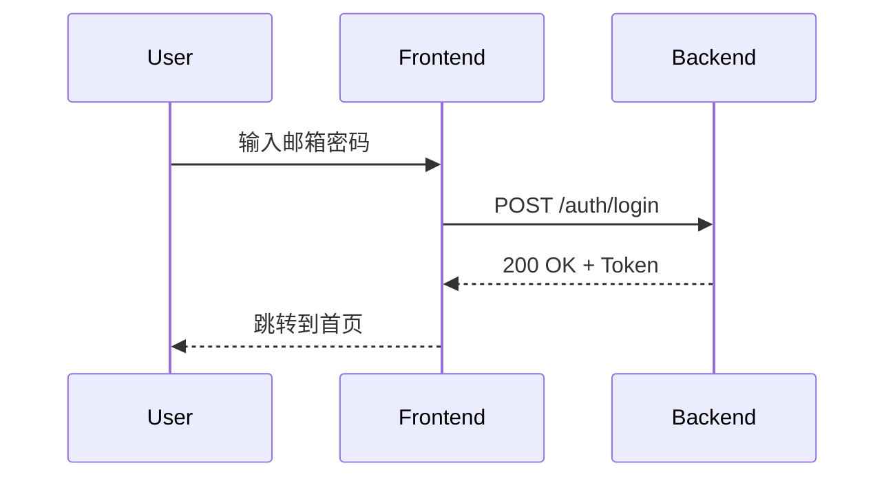

# FRD: [Feature Name / Slice Name]

> **模板说明**：此模板定义了 FRD（Functional Requirement Document）的标准结构。
> 使用时请删除所有说明性文字（以 `>` 开头的引用块），并填写实际内容。

---

## 元信息

| 属性 | 值 |
|------|-----|
| **FRD ID** | FRD-S{X}-{MODULE} |
| **来源切片** | S{X}-{Y}（如 S1-1, S2-2） |
| **覆盖 Feature ID** | F-XXX-001, F-XXX-002, ... |
| **FRD 版本** | v0.1 |
| **最后更新** | YYYY-MM-DD |
| **状态** | 草稿 / 评审中 / 已批准 / 已冻结 |
| **作者** | Human / AI Agent |

### 引用基线规范版本

> 列出本 FRD 依赖的基线规范及其版本，确保可追溯。

| 规范 | 版本 | 说明 |
|------|------|------|
| DOMAIN_MODEL | v0.2 | 涉及的实体：User, Role, App |
| GATEWAY_CONTRACT | v0.1 | 涉及的接口：/auth/login, /auth/logout |
| AUDIT_EVENTS | v0.1 | 涉及的事件：auth.login, auth.logout |
| NFR_BASELINE | v0.2 | 性能指标引用 |
| DESIGN_SYSTEM | v0.1 | 设计令牌、组件规范、状态规范 |

---

## Scope / Out of Scope

### In Scope（本 FRD 覆盖）

> 明确本 FRD 要解决的问题和交付的功能。

- [ ] 功能点 1：...
- [ ] 功能点 2：...
- [ ] 功能点 3：...

### Out of Scope（本 FRD 不覆盖）

> 明确边界，避免范围蔓延。

- ❌ 功能点 A（原因：属于 S{X}-{Y} 切片）
- ❌ 功能点 B（原因：Out-of-Scope for v1.0）

---

## User Story

> 使用标准 User Story 格式描述用户需求。

### US-1：[Story 标题]

**As a** [角色]  
**I want to** [期望行为]  
**So that** [业务价值]

**补充说明**：
- ...

### US-2：[Story 标题]

**As a** [角色]  
**I want to** [期望行为]  
**So that** [业务价值]

---

## UI/UX 描述

> 本章节必须引用 `DESIGN_SYSTEM_P1.md` 中定义的设计令牌和组件规范。
> 交互模式可引用 `design/patterns/` 下的表单/模态框/列表规范。

### 引用的设计规范

| 规范文件 | 引用内容 |
|----------|----------|
| DESIGN_SYSTEM_P1.md | Button(变体/尺寸), Input, Card, 语义色 |
| FORM_PATTERNS.md | 表单校验时机、提交行为 |
| MODAL_PATTERNS.md | 确认弹窗结构 |

### 页面结构

> 描述涉及的页面、布局和主要组件。

| 页面 | 路由 | 主要组件 | 设计稿链接 |
|------|------|----------|------------|
| 登录页 | /login | LoginForm, SocialLogin | [Figma 链接] |
| ... | ... | ... | ... |

### 交互流程

> 使用 Mermaid 或文字描述主要交互流程。



### 状态说明

> 必须覆盖 Loading / Success / Error / Empty 四种状态，参考 DESIGN_SYSTEM_P1.md `通用状态规范` 章节。

| 状态 | 触发条件 | UI 表现 | 引用规范 |
|------|----------|---------|----------|
| Loading | 请求发送中 | 按钮 disabled + Spinner | DESIGN_SYSTEM_P1 `Loading` |
| Success | 请求成功 | Toast 提示 + 跳转 | DESIGN_SYSTEM_P1 `Success` |
| Error | 请求失败 | 错误信息展示 | DESIGN_SYSTEM_P1 `Error` |
| Empty | 无数据 | 空状态占位图 | DESIGN_SYSTEM_P1 `Empty` |

### 响应式设计

> 参考 DESIGN_SYSTEM_P1.md `响应式断点` 章节。

| 断点 | 布局调整 |
|------|----------|
| ≥ 1024px (桌面) | 双栏布局，侧边栏展开 |
| 768px ~ 1023px (平板) | 单栏布局，侧边栏收起 |
| < 768px (移动端) | 底部导航栏 |

### 原型图引用

> 原型图应存放在 `design/slices/S{X}/` 目录下。

| 页面 | 原型文件 | Figma 链接 |
|------|----------|------------|
| 登录页 | `design/slices/S1/login-page.png` | [链接] |
| 登录页-错误状态 | `design/slices/S1/login-page-error.png` | [链接] |

---


## 数据契约

### API 接口

#### POST /api/v1/auth/login

> 描述请求/响应结构、字段类型、必填性。

**Request**

```json
{
  "email": "string (required)",
  "password": "string (required, min 8 chars)",
  "rememberMe": "boolean (optional, default: false)"
}
```

**Response (200 OK)**

```json
{
  "accessToken": "string",
  "refreshToken": "string",
  "expiresIn": "number (seconds)",
  "user": {
    "id": "string (uuid)",
    "email": "string",
    "name": "string"
  }
}
```

**Error Response (401 Unauthorized)**

```json
{
  "error": {
    "code": "AUTH_INVALID_CREDENTIALS",
    "message": "Invalid email or password"
  }
}
```

### 错误码

| 错误码 | HTTP Status | 说明 | 用户可见消息 |
|--------|-------------|------|--------------|
| AUTH_INVALID_CREDENTIALS | 401 | 邮箱或密码错误 | "邮箱或密码不正确" |
| AUTH_ACCOUNT_LOCKED | 403 | 账户已锁定 | "账户已锁定，请稍后重试" |
| AUTH_EMAIL_NOT_VERIFIED | 403 | 邮箱未验证 | "请先验证邮箱" |

---

## Trace / 审计 / 降级要求

### Trace 要求

- [x] 需要 Trace
- Trace 覆盖范围：登录请求全链路
- Trace ID 传递：Request Header `X-Trace-ID` 或 OpenTelemetry `traceparent`

### 审计要求

- [x] 需要审计
- 审计事件类型：

| 事件类型 | 触发时机 | 级别 | 关键字段 |
|----------|----------|------|----------|
| auth.login | 登录成功 | INFO | userId, ip, userAgent |
| auth.login_failed | 登录失败 | WARNING | email, ip, reason |
| auth.logout | 登出 | INFO | userId, ip |

### 降级要求

- [ ] 需要降级
- 降级场景：无（认证为核心链路，无法降级）

---

## 验收标准（AC）

> 每个 AC 对应一个可测试的验收条目，使用 Checkbox 格式便于追踪。

### 功能验收

- [ ] **AC-1**：用户输入正确邮箱密码后，成功登录并跳转到首页
- [ ] **AC-2**：用户输入错误密码后，显示错误提示，账户在 5 次失败后锁定 30 分钟
- [ ] **AC-3**：用户勾选"记住我"后，Session 有效期延长到 7 天
- [ ] **AC-4**：用户点击登出后，Session 失效，跳转到登录页

### 性能验收

- [ ] **AC-P1**：登录接口 P95 响应时间 ≤ 500ms
- [ ] **AC-P2**：SSO 域名识别 P95 ≤ 500ms

### 安全验收

- [ ] **AC-S1**：密码传输使用 HTTPS 加密
- [ ] **AC-S2**：密码存储使用 bcrypt/argon2 哈希
- [ ] **AC-S3**：登录失败日志记录 IP 和 UserAgent

---

## E2E 测试用例

> 定义端到端测试用例，包括正常和异常场景。

### Case 1：正常登录流程

| 步骤 | 操作 | 预期结果 |
|------|------|----------|
| 1 | 访问 /login | 显示登录表单 |
| 2 | 输入正确邮箱密码 | 表单验证通过 |
| 3 | 点击登录按钮 | 显示 Loading 状态 |
| 4 | 等待响应 | 跳转到首页，显示用户名 |

### Case 2：密码错误（失败场景）

| 步骤 | 操作 | 预期结果 |
|------|------|----------|
| 1 | 访问 /login | 显示登录表单 |
| 2 | 输入正确邮箱 + 错误密码 | 表单验证通过 |
| 3 | 点击登录按钮 | 显示 Loading 状态 |
| 4 | 等待响应 | 显示错误提示 "邮箱或密码不正确" |

### Case 3：账户锁定（边界场景）

| 步骤 | 操作 | 预期结果 |
|------|------|----------|
| 1 | 连续 5 次输入错误密码 | 第 5 次后提示账户锁定 |
| 2 | 尝试再次登录 | 提示 "账户已锁定，请 30 分钟后重试" |
| 3 | 30 分钟后重试 | 可正常登录 |

---

## 依赖与风险

### 依赖

| 依赖项 | 类型 | 状态 | 负责人 |
|--------|------|------|--------|
| better-auth 集成 | 技术 | ✅ 已完成 | - |
| 用户表 Schema | 数据模型 | ✅ 已冻结 | - |
| 登录页 UI 设计 | 设计 | 🔵 进行中 | - |

### 风险

| 风险 | 影响 | 概率 | 缓解措施 |
|------|------|------|----------|
| SSO 配置复杂度高 | 延期 | 中 | 先支持邮箱密码，SSO 后续迭代 |
| MFA 用户体验 | 用户流失 | 低 | 提供跳过选项 |

---

## 变更记录

| 版本 | 日期 | 变更内容 | 作者 |
|------|------|----------|------|
| v0.1 | YYYY-MM-DD | 初稿 | Author |
| v0.2 | YYYY-MM-DD | 增加 MFA 场景 | Author |

---

*文档结束*
