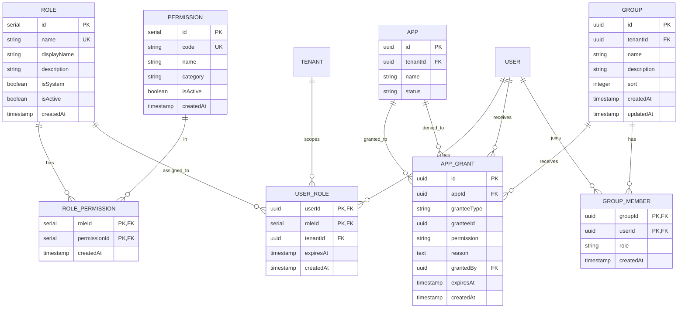
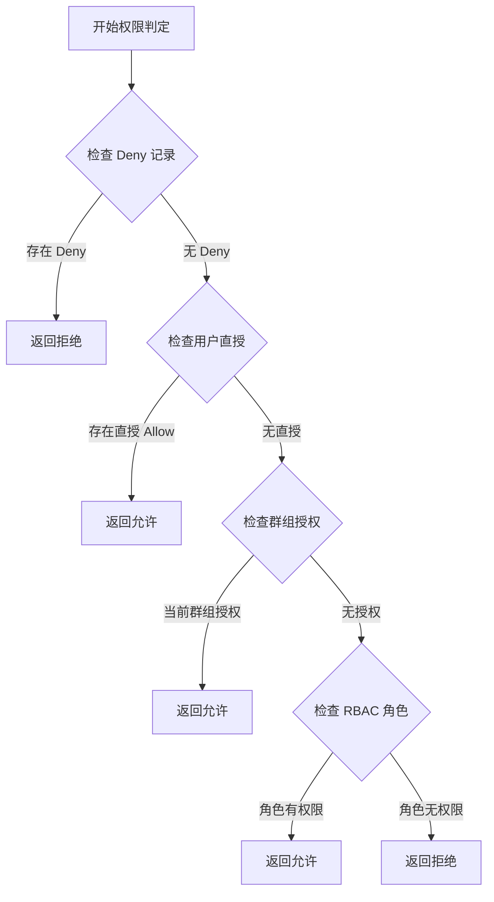

# Data Model: RBAC Authorization Model (S1-2)

**Feature**: 002-rbac-authorization-model
**Created**: 2025-02-11
**Status**: Complete
**Base Model**: DOMAIN_MODEL_P1.md §3.3 RBAC 权限

## Overview

本文档定义 S1-2 切片（RBAC 授权模型）的数据模型，包括 Role、Permission、RolePermission、UserRole、AppGrant 实体，以及与 S1-1 已有实体（GroupMember、App）的集成关系。

---

## 1. 实体关系图 (ERD)



---

## 2. 实体定义

### 2.1 Role（角色）

RBAC 角色定义表。S1-2 预置角色为 `root_admin`、`tenant_admin`、`user`。Manager 不是 Role 表中的独立角色，而是通过 `GroupMember.role='manager'` 判定。

| 字段 | 类型 | 约束 | 说明 |
|------|------|------|------|
| id | serial | PK | 主键 |
| name | varchar(64) | UNIQUE, NOT NULL | 角色标识 |
| displayName | varchar(255) | NOT NULL | 显示名称 |
| description | text | | 描述 |
| isSystem | boolean | DEFAULT false | 系统角色不可删除 |
| isActive | boolean | DEFAULT true | 是否启用 |
| createdAt | timestamp | NOT NULL | 创建时间 |

**预置数据**：

| name | displayName | isSystem | 说明 |
|------|-------------|----------|------|
| root_admin | ROOT ADMIN | true | 平台超级管理员（默认关闭） |
| tenant_admin | Tenant Admin | true | 租户管理员 |
| user | User | true | 普通用户 |

**索引**：
- `(name)` - UNIQUE
- `(isActive)` - 查询启用角色

---

### 2.2 Permission（权限）

权限定义表。S1-2 实现核心权限代码集，后续切片可扩展。

| 字段 | 类型 | 约束 | 说明 |
|------|------|------|------|
| id | serial | PK | 主键 |
| code | varchar(64) | UNIQUE, NOT NULL | 权限代码 |
| name | varchar(255) | NOT NULL | 权限名称 |
| category | varchar(64) | NOT NULL | 分类 |
| isActive | boolean | DEFAULT true | 是否启用 |
| createdAt | timestamp | NOT NULL | 创建时间 |

**权限代码格式**：`{category}:{action}`

**S1-2 核心权限集**：

| code | name | category |
|------|------|----------|
| tenant:manage | 管理租户设置 | tenant |
| tenant:view_audit | 查看审计日志 | tenant |
| group:create | 创建群组 | group |
| group:manage | 管理群组成员 | group |
| app:register | 注册应用 | app |
| app:grant | 授权应用访问 | app |
| app:use | 使用应用 | app |
| conversation:view_others | 查看他人对话 | conversation |
| conversation:export | 导出对话 | conversation |

**索引**：
- `(code)` - UNIQUE
- `(category, isActive)` - 按分类查询

---

### 2.3 RolePermission（角色-权限关联）

角色与权限的多对多关联表。

| 字段 | 类型 | 约束 | 说明 |
|------|------|------|------|
| roleId | serial | PK, FK → Role | 角色 ID |
| permissionId | serial | PK, FK → Permission | 权限 ID |
| createdAt | timestamp | NOT NULL | 创建时间 |

**索引**：
- `(roleId)` - 查询角色权限
- `(permissionId)` - 查询权限关联角色

---

### 2.4 UserRole（用户-角色关联）

用户与角色的多对多关联表。支持租户级角色范围和临时角色（如 Break-glass）。

| 字段 | 类型 | 约束 | 说明 |
|------|------|------|------|
| userId | uuid | PK, FK → User | 用户 ID |
| roleId | serial | PK, FK → Role | 角色 ID |
| tenantId | uuid | FK → Tenant | 角色生效的租户范围 |
| expiresAt | timestamp | | 过期时间（NULL 表示永久） |
| createdAt | timestamp | NOT NULL | 创建时间 |

**使用场景**：
- 永久角色绑定：`expiresAt = NULL`
- Break-glass 临时角色：`expiresAt = NOW() + 1 hour`
- 未来扩展：临时角色提升（如临时 Manager）

**索引**：
- `(userId, tenantId)` - 查询用户在租户的角色
- `(expiresAt)` - 定时任务清理过期记录

---

### 2.5 AppGrant（应用授权）

应用访问授权记录。支持群组授权、用户直授、显式拒绝。

| 字段 | 类型 | 约束 | 说明 |
|------|------|------|------|
| id | uuid | PK | 主键 |
| appId | uuid | FK → App, NOT NULL | 应用 ID |
| granteeType | varchar(32) | NOT NULL | group / user |
| granteeId | uuid | NOT NULL | 群组 ID 或用户 ID |
| permission | varchar(32) | DEFAULT 'use' | use / deny |
| reason | text | | 授权原因（用户直授必填） |
| grantedBy | uuid | FK → User | 授权人 |
| expiresAt | timestamp | | 过期时间（NULL 表示永久） |
| createdAt | timestamp | NOT NULL | 创建时间 |

**授权类型**：

| granteeType | permission | 说明 | 过期行为 |
|-------------|------------|------|----------|
| group | use | 群组→应用授权（主路径） | 手动撤销 |
| user | use | 用户直授例外授权 | 自动过期（≤90天） |
| group | deny | 显式拒绝（群组级） | 手动撤销 |
| user | deny | 显式拒绝（用户级） | 手动撤销 |

**索引**：
- `(appId)` - 查询应用的所有授权
- `(granteeType, granteeId)` - 查询群组/用户的所有授权
- `(expiresAt)` - 定时任务清理过期记录

---

### 2.6 GroupMember（群组成员）

**S1-1 已有实体，S1-2 使用其 role 字段判定 Manager 身份。**

| 字段 | 类型 | 约束 | 说明 |
|------|------|------|------|
| groupId | uuid | PK, FK → Group | 群组 ID |
| userId | uuid | PK, FK → User | 用户 ID |
| role | varchar(32) | DEFAULT 'member' | member / manager |
| createdAt | timestamp | NOT NULL | 加入时间 |

**S1-2 扩展说明**：
- `role='manager'` 判定用户在该群组的 Manager 身份
- Manager 权限仅在其被绑定的群组内生效
- 权限判定时先查 `UserRole` 获取 RBAC 角色，再查 `GroupMember.role` 判定 Manager

---

### 2.7 App（应用）

**S1-2 使用最小字段集，完整定义在 S1-3。**

| 字段 | 类型 | 约束 | 说明 |
|------|------|------|------|
| id | uuid | PK | 主键 |
| tenantId | uuid | FK → Tenant, NOT NULL | 所属租户 |
| name | varchar(255) | NOT NULL | 应用名称 |
| status | varchar(32) | DEFAULT 'active' | active / disabled |

**S1-3 扩展字段**（不在本切片）：
- externalId, externalPlatform, mode, icon, iconType, config, createdBy, updatedAt

---

## 3. 权限判定逻辑

### 3.1 判定输入

```typescript
interface PermissionCheckInput {
  userId: string;        // 用户 ID
  tenantId: string;      // 租户 ID
  activeGroupId: string; // 当前工作群组 ID
  resourceType: string;  // 资源类型 (app, conversation, group, tenant)
  action: string;        // 操作类型 (use, manage, create, delete, etc.)
}
```

### 3.2 判定输出

```typescript
interface PermissionCheckOutput {
  allowed: boolean;      // 是否允许
  reason: string;        // 原因说明
  matchedGrant?: {       // 匹配的授权记录（用于审计）
    grantId: string;
    grantType: 'group' | 'user' | 'role';
    source: string;
  };
}
```

### 3.3 判定流程



**优先级链**：
1. **Deny（显式拒绝）**：最高优先级，任一 Deny 即拒绝
2. **用户直授 Allow**：高于群组授权
3. **群组授权/Manager 用户级授权 Allow**：同级，OR 合并
4. **默认拒绝**：无任何授权时拒绝

### 3.4 伪代码

```typescript
async function checkPermission(input: PermissionCheckInput): Promise<PermissionCheckOutput> {
  // 1. 检查 Deny（最高优先级）
  const denies = await getDenyGrants(input.userId, input.activeGroupId, input.resourceType);
  if (denies.length > 0) {
    return { allowed: false, reason: 'explicit_deny', matchedGrant: denies[0] };
  }

  // 2. 检查用户直授
  const directGrants = await getUserGrants(input.userId, input.resourceType);
  const validDirectGrant = directGrants.find(g => !g.expiresAt || g.expiresAt > now());
  if (validDirectGrant) {
    return { allowed: true, reason: 'user_grant', matchedGrant: validDirectGrant };
  }

  // 3. 检查群组授权
  const groupGrants = await getGroupGrants(input.activeGroupId, input.resourceType);
  if (groupGrants.length > 0) {
    return { allowed: true, reason: 'group_grant', matchedGrant: groupGrants[0] };
  }

  // 4. 检查 RBAC 角色
  const userRoles = await getUserRoles(input.userId, input.tenantId);
  const hasPermission = await checkRolePermission(userRoles, input.resourceType, input.action);
  if (hasPermission) {
    return { allowed: true, reason: 'role_permission' };
  }

  // 5. 默认拒绝
  return { allowed: false, reason: 'default_deny' };
}
```

---

## 4. Drizzle Schema 定义

### 4.1 Role

```typescript
// packages/db/src/schema/rbac.ts
import { pgTable, serial, varchar, text, boolean, timestamp } from 'drizzle-orm/pg-core';

export const roles = pgTable('roles', {
  id: serial('id').primaryKey(),
  name: varchar('name', { length: 64 }).notNull().unique(),
  displayName: varchar('display_name', { length: 255 }).notNull(),
  description: text('description'),
  isSystem: boolean('is_system').default(false).notNull(),
  isActive: boolean('is_active').default(true).notNull(),
  createdAt: timestamp('created_at').defaultNow().notNull(),
});

export type Role = typeof roles.$inferSelect;
export type NewRole = typeof roles.$inferInsert;
```

### 4.2 Permission

```typescript
export const permissions = pgTable('permissions', {
  id: serial('id').primaryKey(),
  code: varchar('code', { length: 64 }).notNull().unique(),
  name: varchar('name', { length: 255 }).notNull(),
  category: varchar('category', { length: 64 }).notNull(),
  isActive: boolean('is_active').default(true).notNull(),
  createdAt: timestamp('created_at').defaultNow().notNull(),
});

export type Permission = typeof permissions.$inferSelect;
export type NewPermission = typeof permissions.$inferInsert;
```

### 4.3 RolePermission

```typescript
export const rolePermissions = pgTable('role_permissions', {
  roleId: serial('role_id').references(() => roles.id, { onDelete: 'cascade' }).notNull(),
  permissionId: serial('permission_id').references(() => permissions.id, { onDelete: 'cascade' }).notNull(),
  createdAt: timestamp('created_at').defaultNow().notNull(),
}, (table) => [
  { name: 'role_permissions_pk', columns: [table.roleId, table.permissionId], isUnique: true },
]);

export type RolePermission = typeof rolePermissions.$inferSelect;
```

### 4.4 UserRole

```typescript
import { users } from './users';
import { tenants } from './tenants';

export const userRoles = pgTable('user_roles', {
  userId: text('user_id').references(() => users.id, { onDelete: 'cascade' }).notNull(),
  roleId: serial('role_id').references(() => roles.id, { onDelete: 'cascade' }).notNull(),
  tenantId: text('tenant_id').references(() => tenants.id, { onDelete: 'cascade' }).notNull(),
  expiresAt: timestamp('expires_at'),
  createdAt: timestamp('created_at').defaultNow().notNull(),
}, (table) => [
  { name: 'user_roles_pk', columns: [table.userId, table.roleId, table.tenantId], isUnique: true },
]);

export type UserRole = typeof userRoles.$inferSelect;
```

### 4.5 AppGrant

```typescript
import { apps } from './apps';
import { users } from './users';

export const appGrants = pgTable('app_grants', {
  id: text('id').primaryKey().$defaultFn(() => crypto.randomUUID()),
  appId: text('app_id').references(() => apps.id, { onDelete: 'cascade' }).notNull(),
  granteeType: varchar('grantee_type', { length: 32 }).notNull(),
  granteeId: text('grantee_id').notNull(),
  permission: varchar('permission', { length: 32 }).default('use').notNull(),
  reason: text('reason'),
  grantedBy: text('granted_by').references(() => users.id),
  expiresAt: timestamp('expires_at'),
  createdAt: timestamp('created_at').defaultNow().notNull(),
});

export type AppGrant = typeof appGrants.$inferSelect;
export type NewAppGrant = typeof appGrants.$inferInsert;
```

---

## 5. 数据迁移

### 5.1 种子数据

```typescript
// packages/db/src/seed/rbac.ts
export const seedRoles = async (db: Database) => {
  await db.insert(roles).values([
    {
      name: 'root_admin',
      displayName: 'ROOT ADMIN',
      description: '平台超级管理员',
      isSystem: true,
      isActive: false, // 默认关闭
    },
    {
      name: 'tenant_admin',
      displayName: 'Tenant Admin',
      description: '租户管理员',
      isSystem: true,
      isActive: true,
    },
    {
      name: 'user',
      displayName: 'User',
      description: '普通用户',
      isSystem: true,
      isActive: true,
    },
  ]).onConflictDoNothing();
};

export const seedPermissions = async (db: Database) => {
  await db.insert(permissions).values([
    // Tenant permissions
    { code: 'tenant:manage', name: '管理租户设置', category: 'tenant' },
    { code: 'tenant:view_audit', name: '查看审计日志', category: 'tenant' },
    // Group permissions
    { code: 'group:create', name: '创建群组', category: 'group' },
    { code: 'group:manage', name: '管理群组成员', category: 'group' },
    // App permissions
    { code: 'app:register', name: '注册应用', category: 'app' },
    { code: 'app:grant', name: '授权应用访问', category: 'app' },
    { code: 'app:use', name: '使用应用', category: 'app' },
    // Conversation permissions
    { code: 'conversation:view_others', name: '查看他人对话', category: 'conversation' },
    { code: 'conversation:export', name: '导出对话', category: 'conversation' },
  ]).onConflictDoNothing();
};

export const seedRolePermissions = async (db: Database) => {
  // Tenant Admin 权限
  const tenantAdmin = await db.query.roles.findFirst({ where: eq(roles.name, 'tenant_admin') });
  const allPermissions = await db.query.permissions.findMany();

  for (const permission of allPermissions) {
    await db.insert(rolePermissions).values({
      roleId: tenantAdmin!.id,
      permissionId: permission.id,
    }).onConflictDoNothing();
  }

  // User 权限（仅 app:use）
  const userRole = await db.query.roles.findFirst({ where: eq(roles.name, 'user') });
  const appUsePermission = await db.query.permissions.findFirst({ where: eq(permissions.code, 'app:use') });

  await db.insert(rolePermissions).values({
    roleId: userRole!.id,
    permissionId: appUsePermission!.id,
  }).onConflictDoNothing();
};
```

---

## 6. 与 S1-1 实体的集成

### 6.1 复用 S1-1 实体

| S1-1 实体 | S1-2 使用方式 |
|-----------|---------------|
| User | 通过 UserRole 关联 Role |
| Tenant | UserRole 的租户范围 |
| Group | AppGrant 的受让方（granteeType=group） |
| GroupMember | role='manager' 判定 Manager 身份 |
| AuditEvent | 新增授权相关审计事件类型 |

### 6.2 新增审计事件类型

```typescript
// S1-2 新增审计事件
const S2_AUDIT_EVENTS = [
  'grant.created',      // 授权创建
  'grant.revoked',      // 授权撤销
  'grant.expired',      // 授权过期
  'deny.created',       // 显式拒绝创建
  'deny.revoked',       // 显式拒绝撤销
  'breakglass.activated', // Break-glass 触发
  'breakglass.expired',   // Break-glass 过期
  'role.assigned',     // 角色分配
  'role.removed',      // 角色移除
];
```

---

## 7. 性能优化

### 7.1 索引策略

```sql
-- 权限判定关键索引
CREATE INDEX idx_user_roles_user_tenant ON user_roles(userId, tenantId) WHERE expiresAt IS NULL OR expiresAt > NOW();
CREATE INDEX idx_app_grants_app ON app_grants(appId);
CREATE INDEX idx_app_grants_grantee ON app_grants(granteeType, granteeId) WHERE expiresAt IS NULL OR expiresAt > NOW();
CREATE INDEX idx_app_grants_deny ON app_grants(granteeType, granteeId) WHERE permission = 'deny';

-- 清理任务索引
CREATE INDEX idx_user_roles_expires ON user_roles(expiresAt) WHERE expiresAt IS NOT NULL;
CREATE INDEX idx_app_grants_expires ON app_grants(expiresAt) WHERE expiresAt IS NOT NULL;
```

### 7.2 缓存策略

```typescript
// Redis 缓存结构
interface PermissionCache {
  key: `perm:${userId}:${tenantId}`;
  value: {
    roles: number[];           // 用户角色列表
    groupGrants: AppGrant[];   // 群组授权
    userGrants: AppGrant[];    // 用户直授
    denies: AppGrant[];        // 显式拒绝
    expiresAt: Date;           // 缓存过期时间
  };
  TTL: 5s;
}
```

---

*本文档基于 DOMAIN_MODEL_P1.md 生成*
